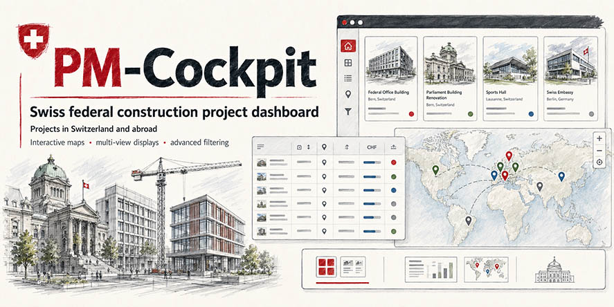

# PM-Cockpit



[](https://opensource.org/licenses/MIT)
[](https://davras5.github.io/pm-cockpit/)
[](https://developer.mozilla.org/en-US/docs/Web/JavaScript)
[](https://maplibre.org/)
[](#tech-stack)

A web-based project management dashboard for Swiss federal construction projects, developed as a concept study for the Bundesamt für Bauten und Logistik (BBL). Visualises, filters, and manages building projects across Switzerland with gallery, list, and map views.

> [!CAUTION]
> **This is an unofficial mockup for demonstration purposes only.**
> All data is fictional. Not all features are fully functional. This project serves as a visual and conceptual prototype — it is not intended for production use.

## Preview

<p align="center">
  
</p>

<p align="center">
  
  
</p>

- Live demo: https://davras5.github.io/pm-cockpit/

## Features

### Core Views
- **Gallery View** — Responsive card grid showing project number, name, status, Ampel indicators (Projektziele / Risiken), portfolio, project manager, and planned investment.
- **List View** — Sortable table with at-a-glance stats (Anzahl Projekte, Sistiert, Geplant, Gesamtinvestition) and a placeholder Excel export.
- **Map View** — Interactive MapLibre map with status-coloured markers, click-to-fly, project popups, and a synchronised sidebar list.
- **Detail View** — Per-project deep-dive with five tabs: Übersicht, Projektziele, Risiken, Grundgrössen und Kennzahlen, and a placeholder Checkliste tab.

### Search & Filtering
- **Text search** across project number, name, city, region, and project manager (debounced).
- **Six filter facets**: Status, Projektziele, Risiken, Teilportfolio, SIA Phase, PLBH (Projektleiter BBL).
- **Click-to-filter** on any status/Ampel chip in the gallery, list, or map view.
- **URL state persistence** — every filter, view mode, and detail-view tab is reflected in the URL for shareable links.

### Project Detail
- **Übersicht** — Stammdaten, Adresse, Region/Kanton, Bauart, planned cost, project manager, plus an image and embedded MapLibre map of the building location.
- **Projektziele** — Editable Ausgangslage / Ziele, cost SOLL/IST comparison with visual variance bar, and toggleable milestone checklist.
- **Risiken** — Categorised risk table (Technisch / Terminlich / Rechtlich / Sonstige) with low/medium/high status indicators.
- **Kennzahlen** — Full BKP cost table (Hauptgruppen 0–9) and SIA 416 volume/area breakdown with Wirtschaftlichkeits-Kennzahlen, Arbeitsplatzkennzahlen, and Formquotienten.

### Swiss conventions
- SIA phases 11–61 (Vorprojekt → Inbetriebnahme).
- CHF currency formatting and de-CH locale throughout.
- German UI, BKP cost groups, Subportfolio classification.

## Tech Stack

| Technology | Version | Usage |
|------------|---------|-------|
| Vanilla JavaScript | ES6+ | Application logic |
| MapLibre GL JS | v4.7 | Interactive WebGL map (no API token required) |
| CARTO Positron | — | Free vector basemap (OpenStreetMap data) |
| CSS3 | Modern | Design tokens, Flexbox, Grid, CSS Variables |
| JSON | Standard | Project & building data with reference tables |
| Material Icons | Google | Icon library |

No build tools or frameworks — pure static files.

## Getting Started

```bash
# Clone
git clone https://github.com/davras5/pm-cockpit.git
cd pm-cockpit

# Serve (pick one):
python -m http.server 8000
# or
npx http-server
# or
php -S localhost:8000
```

Then open http://localhost:8000

> [!NOTE]
> A static file server is required — opening `index.html` directly via `file://` will fail because the app fetches `data.json`.

## Project Structure

```
pm-cockpit/
├── index.html              # SPA markup
├── data.json               # Project & building data with metadata + reference lists
├── css/
│   ├── tokens.css          # Design tokens (color, spacing, typography, shadows)
│   └── styles.css          # Component & layout styles
├── js/
│   └── app.js              # Application logic (state, rendering, filters, URL routing)
├── assets/
│   ├── Social1.jpg         # Social preview image
│   └── images/             # Swiss coat of arms + preview screenshots
├── README.md
└── LICENSE
```

## Deployment

**GitHub Pages:** push to `main`, deploys automatically.

**Alternatives:** Netlify, Vercel, Cloudflare Pages, or any static file server.

## License

Licensed under [MIT](https://opensource.org/licenses/MIT)

---

> [!CAUTION]
> **This is an unofficial mockup for demonstration purposes only.**
> All data is fictional. Not all features are fully functional. This project serves as a visual and conceptual prototype — it is not intended for production use.
