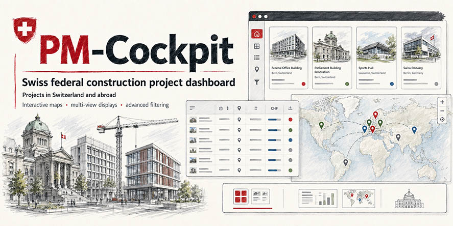

# PM-Cockpit



A browser-based portfolio dashboard for exploring Swiss federal construction projects in gallery, list, map, and detail views.

> [!CAUTION]
> This is an unofficial mockup for demonstration purposes only. All records are fictional, not every function is implemented, and it is not intended for production use.

## Demo

**Live demo:** https://bbl-dres.github.io/ppm-cockpit/

## Features

- Compare projects in responsive gallery, sortable list, and interactive map views.
- Search by project, location, region, or project lead.
- Filter by status, objectives, risks, portfolio, SIA phase, and BBL project lead.
- Review project goals, milestones, costs, risks, building metrics, and SIA 416 figures.
- Share filtered views and open project tabs through URL state.
- Use familiar Swiss project conventions, German labels, and CHF formatting.

## Run locally

The app loads `data.json`, so serve the repository over HTTP:

```bash
python -m http.server 8000
```

Then open <http://localhost:8000/>.

## Documentation

- [Market screening](docs/MARKETSCREEN.md) — wider construction-software context behind the prototype.

## License

Licensed under the [MIT License](LICENSE).
