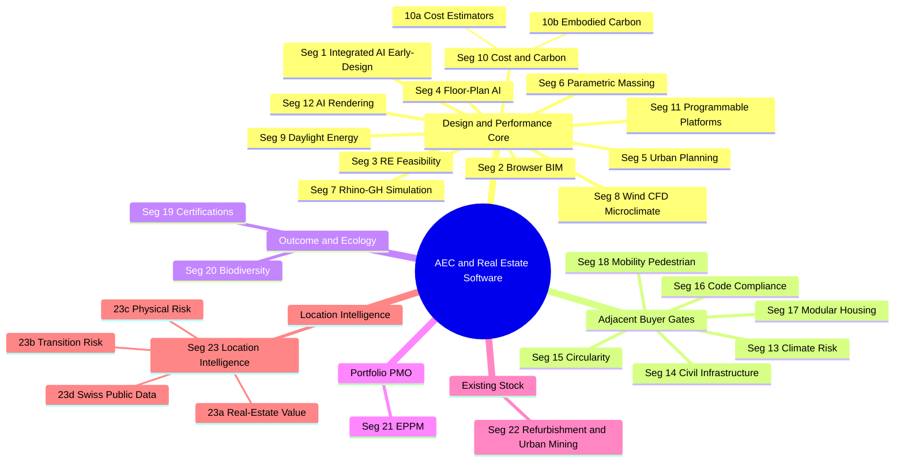

# Market Screening: Software & Platforms across the Construction Project Lifecycle

## Goal

A descriptive market scan of software tools, platforms, datasets, and frameworks that touch the Swiss federal construction project lifecycle — from existing-stock screening and site selection, through design, simulation, certification, cost, carbon, delivery, and portfolio management. **The goal is to map the landscape; this document does not make procurement recommendations.**

## Market map

## Segments at a glance

| # | Segment | Short description |
|---|---|---|
| 1 | [Integrated AI Early-Design / Site Planning Platforms](#segment-1--integrated-ai-early-design--site-planning-platforms) | Cloud platforms with integrated environmental analyses (sun, wind, daylight, carbon) and BIM handoff. |
| 2 | [Browser-Native Concept BIM ("BIM 2.0")](#segment-2--browser-native-concept-bim-bim-20) | Multiplayer browser BIM aiming to replace SketchUp + Revit in early design phases. |
| 3 | [Real-Estate Feasibility & Developer-Facing Tools](#segment-3--real-estate-feasibility--developer-facing-tools) | Parametric site-yield optimisation with financial KPIs baked into geometry. |
| 4 | [Generative Floor-Plan / Unit-Layout AI](#segment-4--generative-floor-plan--unit-layout-ai) | AI engines that emit valid floor plans from a massing + program brief. |
| 5 | [Urban / Site-Scale Collaborative Planning Platforms](#segment-5--urban--site-scale-collaborative-planning-platforms) | GIS + design + scenario analytics for urban-scale projects and approvals. |
| 6 | [Parametric Urban Massing & Zoning Tools](#segment-6--parametric-urban-massing--zoning-tools) | Plugin-based zoning-compliant massing inside host modellers (Rhino / SketchUp). |
| 7 | [Rhino-Grasshopper Environmental Simulation Ecosystem](#segment-7--rhino-grasshopper-environmental-simulation-ecosystem) | Open-source simulation backbone for climate, daylight, energy, CFD (Ladybug, ClimateStudio). |
| 8 | [Specialist Wind / CFD / Microclimate Tools](#segment-8--specialist-wind--cfd--microclimate-tools) | Specialist CFD beyond rapid surrogates (Orbital Stack, SimScale, ENVI-met). |
| 9 | [Specialist Daylight / Energy Early-Stage Tools](#segment-9--specialist-daylight--energy-early-stage-tools) | Daylight, glare, energy modelling with standards compliance (LEED, EN 17037, SIA 380/1). |
| 10 | [Early-Stage Cost & Embodied-Carbon Estimators](#segment-10--early-stage-cost--embodied-carbon-estimators) | Cost (10a: BKI, Keevalue, CostX) and Carbon (10b: One Click LCA, Preoptima, EC3) — distinct buyers. |
| 11 | [Programmable / Developer-Platform Plays](#segment-11--programmable--developer-platform-plays) | Cloud platforms exposing generative-design APIs / SDKs (Hypar, Speckle, ShapeDiver). |
| 12 | [Generative AI Rendering / Text-to-Image](#segment-12--generative-ai-rendering--text-to-image) | Diffusion-model image generators for concept renderings (Veras, ArkoAI, LookX). |
| 13 | [Climate-Risk & Resilience Analytics](#segment-13--climate-risk--resilience-analytics) | Asset-level physical climate-risk diligence for lenders, insurers, owners. |
| 14 | [Civil / Infrastructure Concept Design](#segment-14--civil--infrastructure-concept-design) | Conceptual modelling of site civil works (grading, utilities, access roads). |
| 15 | [Circularity & Material Passports](#segment-15--circularity--material-passports) | Per-project material catalogues for reuse, residual-value, and circularity reporting. |
| 16 | [Code Compliance & Model Checking](#segment-16--code-compliance--model-checking) | Automated code research and BIM rule-based validation. |
| 17 | [Industrialized / Modular Housing Configurators](#segment-17--industrialized--modular-housing-configurators) | Generative platforms producing code-compliant modular multifamily schemes. |
| 18 | [Mobility & Pedestrian Analytics](#segment-18--mobility--pedestrian-analytics) | Transport-demand and pedestrian/crowd simulation at area or campus scale. |
| 19 | [Building Sustainability Certifications & Labels](#segment-19--building-sustainability-certifications--labels) | Software supporting LEED / SNBS / Minergie / DGNB / BREEAM certification workflows. |
| 20 | [Biodiversity & Ecological Analysis](#segment-20--biodiversity--ecological-analysis) | Emerging tools quantifying site / portfolio biodiversity outcomes. |
| 21 | [Enterprise Project Portfolio Management (EPPM)](#segment-21--enterprise-project-portfolio-management-eppm-for-real-estate) | Portfolio-grade systems of record for capital-project tracking and reporting. |
| 22 | [Refurbishment / Renovation Portfolio Screening & Urban Mining](#segment-22--refurbishment--renovation-portfolio-screening--urban-mining) | Pre-project portfolio screening for retrofit-vs-demolish and material-recovery potential. |
| 23 | [Location Intelligence (Market Value, Environmental & Carbon Risk)](#segment-23--location-intelligence-market-value-environmental--carbon-risk) | Real-estate valuation (AVMs) + multi-hazard data + carbon-stranding / transition risk. |

## Summary
- The construction project software market organises into **~23 segments** along two axes: (a) **stage/scale of activity** (existing-stock / urban-mining screening → location intelligence & risk → site / urban planning → massing → unit layouts → environmental and building simulation → cost & embodied carbon → civil/infrastructure → certification & ecology → delivery / portfolio / PMO), and (b) **buyer** (architects, real-estate developers, planners, sustainability consultants, civil engineers, QS / cost planners, code consultants, lenders / insurers, certification assessors, ecologists, portfolio / asset-owner PMOs, renovation strategists, real-estate analysts). No single segment, and no single vendor, covers the lifecycle end-to-end; the market is segmented around different buyer journeys.
- The most consolidated battleground is the "BIM 2.0 / browser-native concept design" cluster (Autodesk Forma, Snaptrude, Arcol, Motif, Qonic) where Autodesk's Spacemaker → Forma move has set the integration bar. But the **buyers who block or kill projects** sit outside that cluster — planners, civil engineers, insurers, QS, code consultants, certification assessors, portfolio PMOs, renovation strategists — and they buy from different vendors. Many of the most consequential Swiss-specific layers (swisstopo, ÖREB / BZO, KBOB, eBKP-H, GEAK, SNBS, GWR) are not first-class citizens in international platforms; the Swiss-domiciled productised players (Luucy for site/zoning, Keevalue for cost, Madaster Switzerland for circularity, NCCS / BAFU layers for climate / hazard) are the most defensible answers where Swiss alignment matters.
- The clearest white spaces in the market are: (1) **regionally-aligned cost taxonomies** (eBKP-H, BKI, DIN 276) — none of the major design-stack tools support them out of the box; (2) **integrated multi-KPI dashboards** that combine embodied carbon, operational energy, daylight, cost, and **physical climate risk** against Swiss benchmarks (KBOB, SNBS 2023.1, BAFU Gefahrenkarten, NCCS CH2025); (3) **data residency in Swiss-sovereign cloud** — almost every international vendor is hosted on US hyperscalers; (4) **Swiss code / zoning compliance automation** beyond BZO ingestion; (5) **commercial real-estate climate valuation** — per the climate-check models registry, "no commercial real estate climate valuation tool exists" combining transition + physical risk + market value in a single offering.
- Regulatory and standards context: the **revised EU EPBD** introduces life-cycle Global Warming Potential (GWP) disclosure for **larger new buildings from 2028** and **all new buildings from 2030**. Switzerland is not bound, but EU-aligned procurement (and the SNBS / KBOB direction) makes this the de-facto baseline. **IFC 4.3** is now published as **ISO 16739-1:2024** and is becoming the interoperability floor. The **RICS Whole Life Carbon Assessment (WLCA) Software Validation Programme (2nd edition, July 2025)** is emerging as a credibility test for LCA tools — **One Click LCA** is the first validated platform. **NCCS Climate Scenarios CH2025** has superseded CH2018 as the federal Swiss climate-projection baseline.

## Key Findings

**Twenty-three market segments identified.** They overlap on functional dimensions but have distinct value propositions, buyers, and competitive sets:

- **Segments 1–12 — design-and-performance core.** Integrated AI early-design, BIM 2.0, feasibility, generative floor plans, urban planning, parametric massing, Rhino/Grasshopper simulation, wind/CFD, daylight/energy, cost & carbon (10a/10b), programmable platforms, AI rendering.
- **Segments 13–18 — adjacent buyer gates.** Climate risk, civil/infrastructure concept design, circularity & material passports, code compliance & model checking, industrialized housing, mobility & pedestrian analytics.
- **Segments 19–20 — outcome / ecology layers.** Building sustainability certifications & labels, biodiversity & ecological analysis.
- **Segment 21 — portfolio / PMO layer.** Enterprise project portfolio management; the system of record under which all the others are reported.
- **Segment 22 — existing-stock / refurbishment / urban-mining.** Pre-project screening of the built stock for retrofit-vs-demolish prioritisation and material-recovery potential.
- **Segment 23 — location intelligence (market value, environmental & carbon risk).** Real-estate valuation, multi-hazard data layers, carbon-stranding & transition-risk models, and the public datasets that feed all of them.

1. Integrated AI early-design / site planning platforms
2. Browser-native concept BIM ("BIM 2.0")
3. Real-estate feasibility & developer-facing tools
4. Generative floor-plan / unit-layout AI
5. Urban / site-scale collaborative planning platforms
6. Parametric urban massing & zoning tools
7. Rhino-Grasshopper environmental simulation ecosystem
8. Specialist wind / CFD / microclimate tools
9. Specialist daylight / energy early-stage tools
10. Early-stage cost & embodied-carbon estimators — split into **10a Cost** (DACH commercial cost-data: BKI, DBD-BIM, Keevalue + global: CostX, CostOS, DESTINI) and **10b Carbon** (One Click LCA, Preoptima, EC3, 2050 Materials)
11. Programmable / developer-platform plays
12. Generative AI rendering / text-to-image for concept
13. **Climate-risk & resilience analytics** (asset-level physical risk)
14. **Civil / infrastructure concept design** (site civil, roads, grading, utilities)
15. **Circularity & material passports**
16. **Code compliance & model checking**
17. **Industrialized / modular housing configurators**
18. **Mobility & pedestrian analytics**

Segments 1 and 2 are converging — Autodesk's announcement of **Forma Building Design** at AU 2025 is a direct response to the BIM 2.0 startups (Arcol, Snaptrude, Motif, Qonic), as covered by Engineering.com and AEC Magazine.

**Major consolidations / shifts:**
- **Spacemaker → Autodesk Forma** (acquired November 2020 for $240M; Spacemaker retired May 2023; existing subscribers migrated to Forma Site Design).
- **Sefaira → Trimble** (acquired February 8, 2016 per Trimble's PRNewswire press release; "Trimble announced today the acquisition of London/New York based Sefaira Ltd., a leading developer of cloud-based software for the design of sustainable and high-performance buildings"; now bundled with SketchUp & Revit plugins).
- **DIVA-for-Rhino → ClimateStudio** (Solemma; DIVA retired, ClimateStudio is the successor for daylight/energy on Rhino 6/7/8).
- **cove.tool → cove** (rebranded January 2025 from software vendor to AI-powered architectural services firm; IP later acquired by ROOST and continued as open source per a July 2025 LinkedIn post by Cove Software).
- **Delve (Sidewalk Labs) → Google** (Sidewalk Labs folded into Google in 2022; Delve was disabled May 2026 with select features integrated into Google Earth per the Sidewalk Labs Wikipedia article).
- **EvolveLAB → Chaos ecosystem** (Veras integrated under Chaos branding).
- **Tally (whole-building Revit LCA) → C.Scale** (April 2026 acquisition per Building Transparency).
- **2050 Materials → Once For All Group** (acquired November 2025 per CEO David Hornsby's statement on onceforall.com: "The acquisition of 2050 Materials marks an important milestone in Once For All's mission to empower the construction industry with data-driven sustainability insights at every stage of a project").
- **JLL ↔ Jupiter Intelligence** strategic expansion (2025) — JLL embedded Jupiter physical climate-risk analytics in CRE workflows, mainstreaming asset-level climate risk in transactions.

**Cloud-first is the dominant trajectory.** Every new entrant since 2020 (Forma, Snaptrude, Arcol, Hypar, Giraffe, TestFit, ARCHITEChTURES, Maket, Finch, DBF, Pollination, **Luucy**, **VU.CITY**, **Preoptima**, **Modulous TESSA**, **Climate X**, **Verifi3D**) launched as SaaS/web. Desktop/plugin holdouts are concentrated in segments 7–9 and 14 (Ladybug, ClimateStudio, ENVI-met, InfraWorks, OpenRoads ConceptStation) where simulation depth, civil-engineering data weight, or host-application integration outweigh cloud convenience.

**Generative AI is fragmented into three families:** (a) **constraint-based generative design** producing valid BIM/geometry (Forma, TestFit, Finch, ARCHITEChTURES, Hypar, Maket, DBF, Modulous TESSA); (b) **diffusion-model image generation** for concept renders (Veras, ARK, ArkoAI, LookX, Midjourney workflows); (c) **text-to-BIM / Copilot** experiments still nascent (Hypar's recent moves, Snaptrude's Copilot, UpCodes Copilot for code research, Preoptima's structural-option Copilot). Only family (a) is decision-ready for federal feasibility studies.

## Details

### Segment 1 — Integrated AI Early-Design / Site Planning Platforms

**Definition.** Cloud platforms that ingest GIS/site context, allow massing creation/import, run a suite of environmental analyses (sun, wind, noise, daylight, embodied carbon, operational energy), and feed a downstream BIM workflow. Differentiator: breadth of integrated analyses + Autodesk-class BIM handoff.

**Persona.** Architects in pre-design / SD; urban developers; municipal planners running competitions.

| Product | Hosting | Pricing | Integrations | Notable |
|---|---|---|---|---|
| **[Autodesk Forma Site Design](https://www.autodesk.com/products/forma)** | Cloud SaaS | $185/mo or $1,445/yr standalone; included in AEC Collection | Revit, Rhino, Dynamo, ACC, IFC/OBJ import | Sun-hours, rapid wind/noise (AI), microclimate, embodied carbon, operational energy |
| **[Forma Building Design](https://www.autodesk.com/products/forma)** (closed beta) | Cloud | TBD | Same Forma cloud layer | Schematic LOD 200–300; facade & interior layouts; GA expected 2026 |

**Maturity.** Mature/consolidating. Forma is the de-facto enterprise default for firms inside the Autodesk ecosystem.

**Competitive dynamics.** Forma's bundle with AEC Collection is a hard price-anchor for competitors. The 2026 March-quarter update of CreativeToolsAI reports **sun hours was the most-used Forma analysis in 2025**, reflecting where the practical adoption sits.

### Segment 2 — Browser-Native Concept BIM ("BIM 2.0")

**Definition.** Multiplayer, browser-based design tools that aim to replace SketchUp + Revit in early phases with a single collaborative model carrying BIM data. Differentiator: real-time co-editing (Figma-like) + native BIM export.

**Persona.** Schematic-design teams, multidisciplinary studios doing client-facing iteration.

| Product | Hosting | Pricing | BIM/Export | Notes |
|---|---|---|---|---|
| **[Snaptrude](https://www.snaptrude.com)** | Cloud (browser) | Free; Pro $499/yr; Org $1,199/yr; Enterprise quote | Bidirectional Revit, Rhino, IFC, DWG | Real-time BOQ/FAR/GFA; "AI Copilot" |
| **[Arcol](https://www.arcol.io)** | Cloud (browser) | Free solo (no Revit export); Team $100/user/mo | Revit export; presentation Boards | Raised approximately $20M per Arcol's own press page (arcol.io/press): "We have raised approximately $20 million from an incredible roster including Cowboy Ventures, Craft Ventures, Procore CEO Tooey Courtemanche, Figma CEO Dylan Field, and former Mozilla CEO John Lilly." |
| **[Motif](https://www.motif.io)** | Cloud (browser) | Quote/early access | Connects to Revit/Rhino | Founded by ex-Autodesk co-CEO Amar Hanspal |
| **[Qonic](https://www.qonic.com)** | Cloud (browser) | Quote | IFC, Revit | Belgian, ex-Bricsys team |
| **[Autodesk FormIt](https://formit.autodesk.com)** | Desktop + Web | Free Pro tier with AEC Collection | Revit Add-in | Older SketchUp competitor; some features now in Forma |

**Maturity.** Emerging. AEC Magazine consistently flags this as an "overheated and over-serviced" segment.

**Competitive dynamics.** All five compete for the same persona; differentiators are depth of BIM data (Snaptrude leads on Revit roundtrip), collaboration UX (Arcol leads), and ecosystem hooks (Motif's leadership pedigree).

### Segment 3 — Real-Estate Feasibility & Developer-Facing Tools

**Definition.** Tools that optimise a parametric site for **yield** (units, GFA, NRSF, parking, pro forma) before architecture begins. Differentiator: financial KPIs (yield-on-cost, NRSF) baked into geometry.

**Persona.** Developers, GCs, architects acting as developer-pitch consultants.

| Product | Hosting | Pricing | Key feature |
|---|---|---|---|
| **[TestFit](https://www.testfit.io)** | Cloud | Site Solver paid (quote); Urban Planner has free tier | Pro forma + automatic parking/earthwork takeoffs; Revit + SketchUp + AutoCAD push |
| **[Spacio](https://www.spacio.ai)** | Cloud SaaS | Free, Personal, Pro (no public USD) | Norway-centric, Norkart import; IFC/Rhino/SketchUp interop |
| **[Giraffe](https://www.giraffe.build)** | Cloud (browser) | Free tier; Core $1,000/yr/user; Portfolio $3,000/yr/user; Enterprise | GIS-first; live pro-forma metrics; IFC export |
| **[Archistar](https://www.archistar.ai)** | Cloud | Quote (~$299/mo+ tier reported) | Site-level feasibility; zoning-rule database (AU/NZ/UK) |
| **[Zenerate](https://zenerate.ai)** | Cloud | Enterprise quote | Multi-family yield; Korean origin |

**TestFit also includes conceptual cost estimation** (TestFit 5.4 release: "You can now utilize the geometry created in TestFit to track your costs throughout feasibility and preconstruction quickly… As your model gets updated, the costs will update in real-time"). This is pro-forma-grade, not 5D-estimator-grade.

**Maturity.** Consolidating. TestFit is dominant in US multi-family; Giraffe owns master-planning + GIS niche.

### Segment 4 — Generative Floor-Plan / Unit-Layout AI

**Definition.** AI engines that take a massing or boundary + program brief and emit valid floor plans (units, circulation, code compliance).

**Persona.** Architects in early SD for multi-family / mixed-use; developer-architects.

| Product | Hosting | Pricing | Output |
|---|---|---|---|
| **[Finch 3D](https://www.finch3d.com)** | Cloud (browser + Rhino/Revit/GH plugins) | Free; Basic €49/mo; Enterprise €12,000/yr for 3 seats | Graph-rule based; Revit/Rhino/GH; AI floor-plan generation gated to Enterprise/AI tier |
| **[ARCHITEChTURES](https://architechtures.com)** | Cloud (browser) | 7-day trial; quote-based | Real-time BIM model, parking layout, IFC + DXF; cost takeoff with user-input unit cost |
| **[Maket.ai](https://www.maket.ai)** | Cloud | Free 50 credits; Pro $20/mo (300 credits) — v2 released 2025 per illustrarch | Residential 1–4 stories; DWG/DXF export "coming soon" |
| **[PlanFinder](https://planfinder.xyz)** | Cloud | Quote | Apartment layout AI, Rhino plugin |
| **[ArkDesign.ai](https://www.arkdesign.ai)** | Cloud | $30–$150/mo individual | Residential layouts |

**Maturity.** Emerging. Output quality varies; per illustrarch's 2026 review, "spatial logic errors are common" — manual review remains required.

### Segment 5 — Urban / Site-Scale Collaborative Planning Platforms

**Definition.** Web platforms that fuse GIS + design + scenario analytics for urban-scale projects, often used by municipalities and master-planners. This segment is where the **planner / municipality buyer** lives, and is the gate at which schemes are approved or refused before architecture begins.

| Product | Hosting | Pricing | Notable |
|---|---|---|---|
| **[Giraffe](https://www.giraffe.build)** | Cloud | $1,000–$3,000/user/yr | GIS-first; live metrics; IFC export |
| **[Luucy](https://www.luucy.ch)** | Cloud SaaS (Swiss-based vendor, Zug/CH) | Free trial "ohne Kreditkarte oder Vertrag"; commercial tiers via quote | **Swiss-native.** Parametric massing + Baupotential analysis; ingests ÖREB (cadastral restrictions), BZO (zoning), swisstopo terrain and survey layers as first-class data; auto-calculated GFA / density / volumes; variant comparison; 2D + 3D layer composition. Reported user base: 150 clients / 6,000 users / 15,000 projects. Partnership with swisstopo. **No BIM (IFC/Revit) roundtrip and no embodied-carbon / cost-taxonomy (eBKP-H/KBOB) modelling advertised today** — verify at procurement. |
| **[Esri ArcGIS Urban](https://www.esri.com/en-us/arcgis/products/arcgis-urban)** | Cloud (Esri) | ArcGIS quote-based | Formal zoning / parcel / land-use / public-engagement workflows; the most planner-grade product on the list; companion to CityEngine |
| **[Esri CityEngine](https://www.esri.com/en-us/arcgis/products/arcgis-cityengine)** | Desktop (Win/Linux) + ArcGIS Pro | $2,200/yr (Pro subscription) or $4,200/yr (Pro Plus) per CG Channel — perpetual licenses discontinued June 2025 | Procedural CGA shape grammars; no environmental sim; FBX/USD/Datasmith exports |
| **[VU.CITY](https://vu.city)** | Cloud (browser + apps) | Quote (city-coverage-based) | 3D city-context twin for planning communication; SiteSolve module for site feasibility within accurate city models. Coverage is **city-by-city** — verify Swiss city coverage before relying on it. |
| **[UrbanFootprint](https://urbanfootprint.com)** | Cloud | Quote-only | US-focused parcel/scenario analytics for utilities, planners, real estate |
| **Cityzenith SmartWorldOS** | SaaS + on-prem | Quote | Digital-twin platform; **status uncertain** — investor commentary suggests an asset transfer to "TwinUp" entity; verify before procurement |
| **Delve (ex-Sidewalk Labs)** | — | — | **Discontinued** — disabled May 2026; features partially folded into Google Earth |
| **[Cityform Lab (MIT) — UNA toolbox](https://cityform.mit.edu/projects/una-rhino-toolbox)** | Free Rhino + ArcGIS plugin | Free / open-source | Pedestrian-route, accessibility, street-network analysis; research tool |

**Swiss-context note.** **Luucy** is the only segment-5 player with native, productised integration of Swiss federal/cantonal geodata (swisstopo, ÖREB-Kataster, BZO). **ArcGIS Urban** is the global benchmark for formal planning workflows but is buyer-configured for Swiss data. Giraffe accepts arbitrary GIS layers and can be made to consume swisstopo WMS/WFS, but the alignment is buyer-side. **VU.CITY** is mainly relevant if a city has been modelled — its Swiss footprint must be confirmed.

### Segment 6 — Parametric Urban Massing & Zoning Tools

**Definition.** Plugin-based or lightweight tools that drive zoning-compliant massing in a host modeller (SketchUp, Rhino).

| Product | Host | Pricing | Notable |
|---|---|---|---|
| **[Modelur](https://modelur.com)** | SketchUp + Rhino plugin | Subscription, USD-based, not publicly listed | Excel LiveSync; CSV/DXF/IFC/KMZ exports; AgiliCity (Ljubljana) |
| **Urbano** | Rhino/Grasshopper | Quote/educational | Network/flow analysis for urban design (vendor URL pending — canonical site not confirmed) |
| **[Digital Blue Foam (DBF)](https://www.digitalbluefoam.com)** | Cloud + DBF Hub desktop | "Custom-made" enterprise pricing | DBF Hub syncs to Revit, Archicad, Rhino; multi-source GIS; AI generative design |

> **Note.** Luucy overlaps with this segment functionally (parametric massing + zoning rule application) but is positioned as a standalone web platform, not a plugin — see Segment 5.

### Segment 7 — Rhino-Grasshopper Environmental Simulation Ecosystem

**Definition.** Open-source / freemium tools running inside Rhino + Grasshopper that bring climate, daylight, energy, CFD into a parametric workflow. The de-facto standard in academic and high-performance consulting practice.

| Product | Pricing | Engine | Coverage |
|---|---|---|---|
| **[Ladybug](https://www.ladybug.tools)** | Free / open-source | Custom | Weather, sun, radiation, comfort |
| **[Honeybee](https://www.ladybug.tools/honeybee.html)** | Free / open-source | Radiance + OpenStudio/EnergyPlus | Daylight, energy |
| **[Butterfly](https://www.ladybug.tools/butterfly.html)** | Free / open-source | OpenFOAM | CFD/wind |
| **[Dragonfly](https://www.ladybug.tools/dragonfly.html)** | Free / open-source | URBANopt | Urban energy |
| **[Pollination Cloud](https://www.pollination.solutions)** | Subscription (publicly listed on pollination.solutions) | Cloud + Rhino + Revit + GH plugins | Native export to EnergyPlus/eQuest/OpenStudio/IES-VE/DesignBuilder/IDA-ICE; gbXML/IFC |
| **[ClimateStudio (Solemma)](https://www.solemma.com/climatestudio)** | Subscription, free trial; commercial + educational tiers | RADIANCE + EnergyPlus | Daylight, glare, energy, comfort; LEED/BREEAM/EN 17037 compliance; Revit-to-Rhino exporter |
| **DIVA-for-Rhino** | Retired (no new sales) | — | Predecessor to ClimateStudio |

**Maturity.** Mature. This is the most credible analytical stack for a federal real-estate organisation that prioritises method transparency and standards alignment.

### Segment 8 — Specialist Wind / CFD / Microclimate Tools

| Product | Hosting | Pricing | Notable |
|---|---|---|---|
| **[Orbital Stack](https://orbitalstack.com)** | Cloud | Credit-based subscriptions (6-month minimum); AI sims + Rapid CFD credits | RWDI-backed; designed for early design |
| **[SimScale](https://www.simscale.com)** | Cloud (browser) | Subscription tiers (publicly listed on simscale.com) | General CFD + structural; AEC pricing tier |
| **[ENVI-met](https://www.envi-met.com)** | Desktop | Subscription tiers (publicly listed on envi-met.com) | Microclimate / urban heat / vegetation |
| **[Autodesk CFD](https://www.autodesk.com/products/cfd)** | Desktop | $1,915/yr (per current Autodesk pricing surveys) | General-purpose CFD; building & MEP |

### Segment 9 — Specialist Daylight / Energy Early-Stage Tools

| Product | Hosting | Pricing | Notable |
|---|---|---|---|
| **[ClimateStudio](https://www.solemma.com/climatestudio)** | Rhino plugin | Subscription | Best-in-class daylight/glare speed; LEED/EN 17037 |
| **[Sefaira (Trimble)](https://sketchup.trimble.com/products/sefaira)** | Cloud + SketchUp + Revit plugins | Subscription via Trimble (publicly listed on trimble.com) | Annual energy + daylight; HVAC sizing |
| **[Autodesk Insight](https://insight.autodesk.com)** | Revit-native + cloud | Included with AEC Collection | Revit-integrated performance and total-carbon analysis; the "in-Revit" alternative to Forma for firms whose authoring lives in Revit |
| **[IES VE](https://www.iesve.com)** | Desktop/cloud | Quote | Full TM52/TM54 compliance |
| **[VELUX Daylight Visualizer](https://www.velux.com)** | Desktop | Free | Daylight factor; quick studies |

### Segment 10 — Early-Stage Cost & Embodied-Carbon Estimators

**Definition.** Tools that convert early geometry into **cost** estimates or **embodied-carbon** estimates. These were originally bundled as one segment, but they sell to **different buyers** (QS / project controls / Bauherrenvertretung vs. sustainability consultants / Nachhaltigkeitskoordinatoren), use **different data taxonomies** (DIN 276 / eBKP-H / BKI Kennwerte vs. EN 15978 / ISO 14040 / KBOB), and consolidate at **different speeds**. This subsection is therefore split into **10a — Cost** and **10b — Embodied Carbon**. Both are exposed to the **EU EPBD 2028 / 2030 GWP disclosure regime** at the carbon end and to procurement-level cost transparency rules at the cost end. The Swiss **eBKP-H / SIA 416 / KBOB gap** lives across both halves.

#### Segment 10a — Early-Stage Cost Estimators

**Persona.** Quantity surveyors, cost consultants, Bauherrenvertretung, federal/canton project managers, architects in SD-stage cost-checks. In DACH the buyer is often the **Architektenkammer-affiliated cost-data buyer** (BKI subscriber) or the **BIM-coordinator-driven cost-modelling buyer** (DBD-BIM, CostX).

| Product | Type | Origin / Coverage | Hosting | Pricing | Notes |
|---|---|---|---|---|---|
| **[TestFit](https://www.testfit.io)** | Pro forma + takeoffs | US | Cloud | Subscription | See Segment 3; pro-forma-grade, not 5D-estimator-grade |
| **[Beck Technology DESTINI Estimator](https://beck-technology.com)** | 2D/3D takeoff + estimating | US | Cloud (SOC 2) + legacy desktop | Quote-only ("Call us for a license quote") | GC/preconstruction focus; **DESTINI Profiler** is the conceptual 5D companion ("combining 3D modeling with pricing… allows the clients to visualize in 5D", constructiontechreview.com) |
| **[RIB CostX (iTWO)](https://www.rib-software.com)** | 5D BIM takeoff/estimating | Global (RIB / Schneider) | On-prem + SaaS | Quote-only (no free version per TrustRadius) | IFC + RVT; "world-leading 6D BIM solution… also supports the EC3 carbon rate library from Building Transparency" (rib-software.com) |
| **[Nomitech CostOS](https://www.nomitech.com)** | Feasibility → detailed estimating | Global | Cloud + desktop | Quote | GIS / 2D / BIM estimating continuum; **classification-flexible engine** — the most likely commercial product to be re-configurable to eBKP-H |
| **[BKI Baukosteninformationszentrum](https://bki.de)** | Cost-data publisher + planning software | Germany (architect-chamber affiliated, Stuttgart) | Desktop + emerging web (KoRa, launching June 2026) | Tiered: free test versions; publications €92–€1,247+ (7–19% VAT) | **BKI Kostenplaner** is the de-facto Architektenkammer cost-planning tool in DE; **BKI Objektdaten** is the canonical building-cost reference database; uses **DIN 276**. Companion tools: **BKI Energieplaner** (GEG), **BKI Honorarermittler** (HOAI), **BKI IFC-Mengenermittler** (BIM takeoff). Austrian regional factors available; not natively Swiss but DIN 276 → eBKP-H mapping is well-trodden in DACH practice. |
| **[DBD-BIM (Dynamische BauDaten)](https://www.dbd.de/dbd-bim/)** | BIM-based cost-data platform | Germany (Dr. Schiller & Partner / DBD) | Online + offline variants | Free 7-day test; commercial tiers via quote | "Bauteile suchen, detailliert beschreiben und mit dem Modell verknüpfen" — searches building components, configures them with technical attributes, links to the BIM model with **DIN 276** cost structure, **STLB-Bau** VOB-compliant specifications, and **DIN BIM Cloud** attribute standards. Real-time cost recalculation as properties change. Integrates with 24+ AEC applications. |
| **[Keevalue](https://www.keevalue.ch)** | Baukostenschätzung / Baukostenberechnung | **Switzerland** | Cloud SaaS (CH vendor) | Not publicly listed | Marketed as cost estimation and cost calculation **"Für Architekten, Bauherren & Co."** Swiss-domiciled vendor, which makes it a natural counter-party to Luucy on the cost layer — verify eBKP-H / SIA 416 alignment, hosting region, and BIM intake at procurement. |

**Non-exhaustive.** The DACH cost-data market has many smaller specialised vendors (NPK / CRB element catalogues, pom+ services, cantonal building-cost portals, in-house Excel-based Kennwert databases at the larger Generalplaner) that are not productised as platforms. A Swiss-specific cost-tooling diligence pass should be expected to surface 5–10 additional candidates beyond this list.

**Critical Swiss-cost gap for BBL.** None of the above are **natively** eBKP-H-aware out of the box. The four most realistic paths to a Swiss-aligned cost stack today are: (a) **BKI** for DIN 276 cost references + an internal DIN 276 → eBKP-H mapping table (DACH-practice standard); (b) **DBD-BIM** if the BIM model is mature enough to drive component-level costs; (c) **CostOS** because its classification engine is flexible enough to host a custom eBKP-H structure; (d) **Keevalue** as a Swiss-native candidate to be evaluated first for any new SD-stage cost workflow. **CostX** is the safer choice when BIM-takeoff fidelity matters more than Swiss-classification fluency.

#### Segment 10b — Embodied-Carbon Estimators & Optioneering

**Persona.** Sustainability consultants, Nachhaltigkeitskoordinatoren, architects with sustainability responsibility, ESG-driven owner reps. The buyer is increasingly the **owner** under EPBD 2028 / 2030.

| Product | Type | Hosting | Pricing | Notes |
|---|---|---|---|---|
| **[One Click LCA](https://www.oneclicklca.com)** | Whole-building LCA + Carbon Designer 3D | Cloud SaaS + plugins | Subscription, quote-based (Carbon Designer 3D bundled with Designer tier+) | Revit, Rhino+GH, Tekla, IES-VE, DesignBuilder, IFC, Forma extension; EN 15978/15804, ISO 14040/14067, **RICS WLCA validated** (1st in world, July 2025), EU Level(s), DGNB |
| **[Preoptima](https://www.preoptima.com)** | Concept-stage carbon optioneering | Cloud SaaS | Subscription / quote | **Decision-centric** carbon comparison of structural / envelope options at concept stage (timber vs. hybrid vs. concrete) with real-time feedback; complements One Click LCA rather than replacing it |
| **[Building Transparency EC3](https://www.buildingtransparency.org/ec3)** | Upfront A1–A3 embodied-carbon (EPD-based) | Cloud (free) | Free + open access ("the only free and open-access global embodied carbon accounting tool" — buildingtransparency.org) | tallyCAT Revit plug-in (free); integrates with ACC, Procore, cove.tool, One Click LCA |
| **[2050 Materials](https://2050-materials.com)** | Materials sustainability data + API | Cloud + REST API | Free web + commercial API | 150,000+ products, 100,000+ EPDs; acquired by Once For All Group in November 2025 |
| **[cove (ex-cove.tool)](https://cove.inc)** | AI services + IP | Cloud | Service fees | IP acquired by ROOST and continued as open source per Cove Software's July 2025 LinkedIn post |

**Materials / Reference-Data Layer (not estimators, but feed both 10a and 10b).** A handful of catalogues sit alongside the estimator tools as authoritative **product / material reference databases**. They are *data layers*, not cost or carbon engines:

| Source | Origin | What it is | Use in BBL stack |
|---|---|---|---|
| **[werk-material.online](https://werk-material.online)** | Switzerland | Swiss building-materials database (product catalogue, not a cost estimator) | Reference layer for materials selection, specification, and downstream LCA/cost work; cross-link with 2050 Materials, KBOB, and Madaster |
| **[KBOB Ökobilanzdaten](https://www.kbob.admin.ch/de/oekobilanzdaten-im-baubereich)** | Switzerland (federal) | Authoritative Swiss LCA dataset (Ökobilanzdaten im Baubereich) | The reference dataset One Click LCA / Preoptima / Bauteilkatalog must speak to be defensibly "Swiss" |
| **[Lesosai](https://lesosai.com)** / Bauteilkatalog | Switzerland (BFE / academic-industrial) | KBOB-aligned building-element LCA datasets | The de-facto fallback when an international LCA tool can't natively load KBOB |

**Critical Swiss-carbon gap for BBL.** **One Click LCA + a custom KBOB dataset** is the closest plug-and-play candidate; the KBOB alignment is the buyer's responsibility. **Preoptima** accelerates structural option-comparison upstream but is not KBOB-native. For circular / residual-value tracking, the answer is **Madaster Switzerland** (Segment 15), not a Segment-10b product. **Luucy does not currently advertise embodied-carbon output**, so it does not close this gap even though it owns the upstream Swiss geometry/zoning layer.

### Segment 11 — Programmable / Developer-Platform Plays

**Definition.** Cloud platforms that expose a generative-design API/SDK so firms can encode their own logic.

| Product | Hosting | Pricing | Notable |
|---|---|---|---|
| **[Hypar](https://hypar.io)** | Cloud | Free / Pro / Enterprise tiers (publicly listed on hypar.io) | C#/Python functions; Revit/Rhino/IFC/DWG export; $8.28M total raised across 4 rounds; the most recent was a $5.5M Series A on June 22, 2023, led by Brick & Mortar Ventures with participation from Building Ventures (per PR Newswire and Tracxn/PitchBook funding records); bundled "workplace planner" sector app |
| **[Speckle](https://speckle.systems)** | Cloud + self-host (open source) | Free / Workspaces (paid) | Data hub / connectors across BIM apps; Speckle Automate beta |
| **[ShapeDiver](https://www.shapediver.com)** | Cloud | Subscription tiers (publicly listed on shapediver.com) | Grasshopper-as-a-service web embedding |

### Segment 12 — Generative AI Rendering / Text-to-Image

**Definition.** Diffusion-model image generators producing concept renderings from massing geometry or text prompts. Not analytically rigorous; presentation/ideation only.

| Product | Hosting | Pricing | Hosts |
|---|---|---|---|
| **[Veras (EvolveLAB / Chaos)](https://www.evolvelab.io/veras)** | Plugin + web | $149/yr student tier listed; commercial subscription | Revit (2021–2026), SketchUp (2021–2025), Rhino 7/8, Forma (Web), Archicad 28, Vectorworks 2024/25 |
| **[ARK / ArkoAI](https://arko.ai)** | Plugin | Subscription tiers (publicly listed on arko.ai) | Revit, SketchUp |
| **[LookX](https://www.lookx.ai)** / **[ArchiVinci](https://www.archivinci.com)** | Web | Freemium | Web-based |
| **[Midjourney](https://www.midjourney.com)** / **[Stable Diffusion](https://stability.ai)** / **[DALL·E](https://openai.com/dall-e-3)** | Web | Various | Generic; widely used as workaround |

### Segment 13 — Climate-Risk & Resilience Analytics

**Definition.** Asset-level physical climate-risk analytics — flood, wind, heat, wildfire, subsidence — used to underwrite, insure, finance, and disclose. A scheme can be financeable in form but unfinanceable in insurance/risk terms; this segment is now an entry-stage diligence gate, not a post-design afterthought.

**Persona.** Real-estate investors, lenders, insurers, ESG / portfolio teams. Increasingly architects and project managers as resilience features are required by clients or by EU/Swiss disclosure rules.

| Product | Hosting | Pricing | Notable |
|---|---|---|---|
| **[Climate X](https://www.climate-x.com)** | Cloud SaaS | Quote | CRE-oriented asset-level physical-risk analytics |
| **[Jupiter Intelligence](https://jupiterintel.com)** | Cloud SaaS | Quote (enterprise) | Portfolio + compliance workflows; strategic relationship with JLL expanded in 2025 |
| **[First Street](https://firststreet.org)** | Cloud + API | Quote; some asset-level freemium lookup | Property-level risk and financial-impact screening; deepest US data, increasing global coverage |

**Swiss-context note.** Authoritative Swiss climate-hazard data lives in **BAFU Gefahrenkarten** (cantonal hazard maps), **NCCS Climate Scenarios CH2025** (which supersede CH2018), **ERM-CH23** (national earthquake model, 2M+ buildings), and the cantonal Naturgefahren-Portale aggregated via geodienste.ch. The international vendors in this segment typically rely on global hazard models rather than these Swiss layers. See Segment 23d for the full Swiss public dataset inventory.

### Segment 14 — Civil / Infrastructure Concept Design

**Definition.** Conceptual modelling of site civil works — access, grading, earthworks, stormwater, utilities, road corridors — that often determine site feasibility before architecture begins.

**Persona.** Civil engineers, land-development engineers, public-infrastructure owners. Increasingly invoked by federal PMs and architects on constrained sites (steep terrain, brownfields, dense utility right-of-ways).

| Product | Hosting | Pricing | Notable |
|---|---|---|---|
| **[Autodesk InfraWorks](https://www.autodesk.com/products/infraworks)** | Desktop + cloud | Included in AEC Collection | Concept-stage civil + transportation + utility context modelling; Revit and Civil 3D handoff |
| **[Bentley OpenSite+](https://www.bentley.com/software/opensite-design)** | Desktop + cloud | Quote | AI-assisted land-development site design; grading and stormwater focus |
| **[Bentley OpenRoads ConceptStation](https://www.bentley.com/software/openroads-conceptstation)** | Desktop | Quote | Early roadway / bridge concepting with traffic-aware logic |

**Why it matters for BBL.** Federal sites with difficult access, steep grading, or constrained utilities can be ruled out — or have their cost envelope blown — before any architectural concept matters. None of the design-stack tools (Forma, Giraffe, Luucy) replace civil concept modelling.

### Segment 15 — Circularity & Material Passports

**Definition.** Platforms that catalogue and value the material composition of buildings to enable reuse, residual-value calculation, and circularity reporting.

**Persona.** Public owners (esp. federal / cantonal), ESG-driven private owners, circular-construction consultancies. Complements but does not replace LCA tools (Segment 10).

| Product | Hosting | Pricing | Notable |
|---|---|---|---|
| **[Madaster](https://madaster.com)** ([Switzerland: madaster.ch](https://madaster.ch)) | Cloud, multi-region incl. **Madaster Switzerland** | Subscription / quote | Material passports, circularity index, environmental impact, residual-value; IFC + Excel intake; Swiss platform operated locally |

**Why it matters for BBL.** Swiss federal direction on circular economy (Bundesrat Aktionsplan Kreislaufwirtschaft) is pushing public owners toward building-level material accounting. Madaster is the only mature productised player with an explicit Swiss platform; the alternative is a custom Speckle / Rhino / KBOB workflow.

> **Cross-reference.** Segment 15 covers material passports **per project, during and after construction**. The **portfolio-scale "should we refurbish, deep-retrofit, or demolish?" screening question** — including upstream urban-mining estimation on existing stock — is a different buyer journey and is handled in **Segment 22 (Refurbishment / Renovation Portfolio Screening & Urban Mining)**.

### Segment 16 — Code Compliance & Model Checking

**Definition.** Tools that automate code research (text → applicable rules) and model checking (geometry → rule violations).

**Persona.** Architects (code research), BIM coordinators (model validation), specialist code consultants.

| Product | Hosting | Pricing | Notable |
|---|---|---|---|
| **[UpCodes / UpCodes Copilot](https://up.codes)** | Cloud (browser) | Subscription tiers | Jurisdiction-specific AI code research; US-centric coverage today |
| **[Verifi3D (now Solibri Checkpoint)](https://www.solibri.com/checkpoint)** | Cloud (browser) | Quote | BIM model validation; rule-based IFC checking. **Acquired into Solibri** — the verifi3d.com domain now redirects to Solibri's Checkpoint product page. |
| **[Solibri](https://www.solibri.com)** | Desktop + cloud | Subscription | Mature rule-based model checking; widely used in EU; supports custom rulesets |

**Swiss gap.** None of the international code tools natively cover **SIA norms** or cantonal building regulations (BZO/BNO). Solibri's strength is its configurability — Swiss rulesets are theoretically achievable but a buyer-side build. **Luucy** partially handles BZO at the zoning envelope layer only, not at the building-code layer.

### Segment 17 — Industrialized / Modular Housing Configurators

**Definition.** Generative platforms producing code-compliant multifamily schemes built around an industrialized kit-of-parts, with cost, carbon, and BIM outputs in a single run.

**Persona.** Multifamily developers, public-housing programmes, modular-construction firms. For BBL specifically, relevant only for repeatable typologies (asylum reception, border-guard housing, federal staff housing) — not for heritage / specialist federal buildings.

| Product | Hosting | Pricing | Notable |
|---|---|---|---|
| **[Modulous TESSA](https://www.modulous.com)** | Cloud | Quote | Generates optimized multifamily schemes with cost plans, A1–A3 carbon metrics, Revit / IFC exports |

### Segment 18 — Mobility & Pedestrian Analytics

**Definition.** Transport-demand modelling and pedestrian/crowd capacity simulation at area, campus, or facility scale.

**Persona.** Transport planners, urban designers, large public-facility owners (stations, museums, campuses).

| Product | Hosting | Pricing | Notable |
|---|---|---|---|
| **[PTV Visum](https://www.ptvgroup.com/en/products/ptv-visum)** | Desktop | Subscription | Macroscopic transport-demand modelling; public-sector standard in Switzerland and EU |
| **[Bentley LEGION](https://www.bentley.com/software/legion-simulator)** | Desktop / cloud | Quote | Pedestrian / crowd simulation for stations and dense nodes |

**Relevance for BBL.** Specialist; invoked for federal projects with significant public flow (e.g. SBB station-adjacent buildings, large administrative campuses). Not a default in the early-design stack.

### Segment 19 — Building Sustainability Certifications & Labels

**Definition.** Tooling that supports formal building-label certification — workflow management, criteria evidence, scorecard tracking, and assessor-facing submissions. Distinct from Segment 10b (carbon estimators) and Segment 9 (energy tools), which **feed** certifications but do not themselves certify. The buyer is the certification assessor, the Nachhaltigkeitskoordinator, or the owner under EU EPBD / federal sustainability requirements.

**Persona.** Sustainability consultants pursuing certification credits, certification assessors, owner sustainability leads, project teams targeting Minergie / SNBS / DGNB / LEED / BREEAM.

| Label / System | Operator | Tooling shape | Notes |
|---|---|---|---|
| **[SNBS Hochbau 2023.1](https://www.snbs-hochbau.ch)** | **NNBS** (Netzwerk Nachhaltiges Bauen Schweiz), supported by BAFU, ASTRA, BAG, BFE, armasuisse, KBOB | Document-based criteria scorecard; registration and information via **snbs-hochbau.ch** (Anmeldung); no advertised end-to-end digital certification platform | The de-facto federal Swiss sustainability standard. **Already in use by KBOB / armasuisse** — directly relevant for BBL. Verify whether NNBS publishes a 2026 or 2027 digital platform update. |
| **[Minergie / Minergie-Eco / Minergie-A / Minergie-P](https://www.minergie.ch)** | Verein Minergie | Online certification portal via **minergie.ch**; module-based application workflow; SIA 380/1 alignment | Swiss energy + (for Eco) ecology + materials anchor; federal buildings routinely Minergie-certified at minimum. |
| **[DGNB System](https://www.dgnb.de)** | Deutsche Gesellschaft für Nachhaltiges Bauen | DGNB criteria matrix (Excel-based historically; web tooling expanding); independent assessor model | German federal benchmark; DGNB criteria fed by **One Click LCA** for life-cycle parts. Used in DACH cross-border procurement. |
| **[LEED v4 / v4.1](https://www.usgbc.org/leed)** | USGBC + GBCI | **LEED Online** web platform — full submission, review, scorecard, certification workflow | Global benchmark; mostly used for international-corporate or US-aligned procurement. Not Swiss-federal default. |
| **[BREEAM](https://breeam.com)** | BRE Global (UK) + national operating partners | **BREEAM Projects** / BREEAM In-Use platforms; assessor-driven submissions | EU-common; UK-dominant. Less common in Swiss federal procurement. |
| **[WELL Building Standard](https://www.wellcertified.com)** | International WELL Building Institute (IWBI) | **WELL Online** portal; v2 scorecard + post-occupancy verification | Health/wellness focus; complements (not replaces) LEED/DGNB. |
| **[EDGE](https://edgebuildings.com)** | IFC / World Bank Group | Browser-based EDGE App (free) for emerging-market efficiency certification | Mostly used outside DACH. Listed for completeness. |
| **[GRESB](https://www.gresb.com)** | GRESB BV | Annual portfolio-level ESG benchmarking platform | **Portfolio-scale**, not project-scale. Relevant if BBL benchmarks its real-estate ESG performance externally. |
| **[EU Level(s)](https://green-business.ec.europa.eu/levels_en)** | EU Commission (DG ENV) | Framework + indicator set (not a software product); fed by One Click LCA, Madaster, others | The EU's common sustainability-reporting framework feeding national codes; reference, not a buyable tool. |

**Cross-references.** **One Click LCA**, **EC3**, **Sefaira**, **ClimateStudio**, **Madaster**, and **2050 Materials** all *feed* certifications — they are tools the certification platforms accept as evidence sources. **No general-purpose "certification meta-platform" exists** that aggregates submissions across SNBS + DGNB + LEED + Minergie; each label is its own ecosystem.

**Swiss-context note.** For BBL the relevant labels are, in approximate order of federal weight: **Minergie / Minergie-Eco**, **SNBS Hochbau 2023.1**, and **DGNB** for cross-border / DACH-procurement projects. **LEED and BREEAM** are mostly relevant when BBL participates in international competitions or hosts an international tenant. SNBS tooling is currently document-based; a 2026+ digital platform should be tracked as a watch-list item.

### Segment 20 — Biodiversity & Ecological Analysis

**Definition.** Tools that quantify and improve biodiversity / ecological outcomes at the site or portfolio level. Genuinely **emerging** — most biodiversity work in AEC is still **consultant-led ecology** with internal spreadsheets, not productised tooling. The most-codified piece is the UK statutory **Biodiversity Net Gain (BNG)** regime (Environment Act 2021, statutory from 2024) which has spawned the first generation of commercial calculators.

**Persona.** Ecologists, landscape architects, sustainability consultants, public-realm planners. For BBL, mostly relevant via **SNBS / Minergie-Eco ecology criteria** and federal **NHG (Natur- und Heimatschutzgesetz)** obligations.

| Tool / Resource | Origin | Type | Notes |
|---|---|---|---|
| **[Defra Statutory Biodiversity Metric](https://www.gov.uk/government/publications/statutory-biodiversity-metric-tools-and-guides)** | UK government (Defra) | Free downloadable Excel calculator | The official UK BNG calculation tool, statutory since 2024. Cited globally as the reference metric. |
| **Cundall BNG Tool** (and similar from Buro Happold, WSP, Arup) | UK consultancies | Proprietary calculators built on Defra metric | Used by consultants delivering BNG-bound projects; not generally licensed externally. |
| **[ENVISION](https://sustainableinfrastructure.org/envision/)** | ISI (Institute for Sustainable Infrastructure) | Sustainability rating framework for infrastructure incl. ecology criteria | Project-rating framework; mostly used in North-American civil/infra. |
| **[IUCN STAR metric](https://www.iucn.org/resources/conservation-tool/species-threat-abatement-and-restoration-metric)** | IUCN | Species-Threat-Abatement-and-Restoration metric | Scientific reference for biodiversity-loss / restoration scoring; consumed by some corporate ESG tooling, not a productised AEC tool. |
| **[iNaturalist](https://www.inaturalist.org)** / **[GBIF](https://www.gbif.org)** / **[InfoSpecies (CH)](https://www.infospecies.ch)** | Public / CC ecology data | Species occurrence databases | Reference data layers, not tools; **InfoSpecies** is the Swiss federal data clearing house. |
| **[BAFU Biotoptypen](https://www.bafu.admin.ch/bafu/de/home/themen/biodiversitaet.html)** / ÖREB-Naturwerte layers | Switzerland (federal) | GIS data layers (via swisstopo / cantonal portals) | Authoritative Swiss biodiversity baselines for site-level assessments. |
| **TNFD-aligned platforms (emerging)** — e.g. NatureAlpha, ESG Book, S&P Nature & Biodiversity Risk | Multiple | Portfolio-/corporate-level nature-risk analytics | Aimed at investor disclosure (TNFD framework), not project design. |

**Maturity.** Emerging. The AEC market lacks a Forma-grade productised biodiversity tool today. Consultant-led ecology assessment remains the norm in Switzerland, supported by GIS overlays from **BAFU**, **InfoSpecies**, and cantonal Naturschutz portals. Productisation is likely to follow if/when Switzerland adopts a statutory BNG-equivalent or as TNFD disclosure becomes a federal-procurement requirement.

**Swiss-context note.** For BBL today, **biodiversity sits inside SNBS / Minergie-Eco criteria and NHG-compliance assessment**, not in a dedicated tool. The realistic two-year posture is (a) commission consultant-led ecology assessments per project, (b) layer **InfoSpecies / BAFU biotope** data on top of Luucy or Giraffe / ArcGIS Urban as a GIS overlay for screening, (c) track TNFD and the EU Nature Restoration Law for emerging procurement-disclosure requirements.

### Segment 21 — Enterprise Project Portfolio Management (EPPM) for Real Estate

**Definition.** Portfolio- and PMO-grade systems of record that track projects across an entire owner portfolio: status, SIA phase, milestones, risks, cost, schedule, resources, KPIs, and reporting up to executive / political stakeholders. Distinct from segments 1–20 (project-level tools) — this is the **system of record above them**.

**Persona.** Owner Bauherrenvertretung, public-sector PMOs, real-estate portfolio managers, Generalplaner managing many simultaneous projects, federal political-reporting users.

| Product | Hosting | Pricing | Notable |
|---|---|---|---|
| **[Oracle Primavera P6 + Unifier + Aconex](https://www.oracle.com/construction-engineering/primavera-p6/)** | Cloud + on-prem | Enterprise quote | Global enterprise / government default for capital-projects portfolio management; deep schedule + risk + cost + contract administration. The benchmark for public-sector capital programmes. |
| **[Microsoft Project / Project for the Web / Project Online](https://www.microsoft.com/en-us/microsoft-365/project/project-management-software)** | Cloud (M365) + on-prem | M365 licensing tiers | Default in any Microsoft-shop organisation; lower ceiling than Primavera but adequate for mid-sized portfolios. |
| **[Procore Capital Projects + Portfolio Financials](https://www.procore.com)** | Cloud SaaS | Enterprise quote | Construction-native PMO; strong on schedule/cost/issue tracking; weaker on early-design and KPI dashboards. |
| **[Autodesk Construction Cloud (ACC)](https://construction.autodesk.com)** — Cost / Build / BIM Collaborate | Cloud SaaS | Subscription | Autodesk's portfolio play; tightly integrated with Revit + Forma; portfolio dashboards expanding. |
| **[InEight](https://ineight.com)** | Cloud SaaS | Enterprise quote | Capital-project portfolio management; strong on cost-and-schedule integration; large infrastructure-owner footprint. |
| **[Planview](https://www.planview.com)** / **[Sciforma](https://www.planview.com/acquisitions/about-sciforma/)** / **[Cora PPM](https://corasystems.com)** | Cloud SaaS | Enterprise quote | Generic enterprise PPM platforms; Cora PPM has notable UK/EU public-sector adoption (e.g. defence, infrastructure). **Sciforma was acquired by Planview** — sciforma.com now redirects to Planview's acquisition page. |
| **[Asta Powerproject (Elecosoft)](https://www.elecosoft.com/asta-powerproject/)** | Desktop + cloud | Quote | UK construction-PMO favorite; schedule-strong. |
| **[PMWeb](https://www.pmweb.com)** | Cloud + on-prem | Enterprise quote | Capital-projects PMO with cost + risk + portfolio; common in Middle-East / public-sector procurement. |
| **[Smartsheet](https://www.smartsheet.com)** / **[Monday.com](https://monday.com)** / **[Wrike](https://www.wrike.com)** / **[ClickUp](https://clickup.com)** | Cloud SaaS | Per-user subscriptions | Lightweight PPM; widely used at smaller scale but not capital-project-grade for federal portfolios. |
| **[OpenProject](https://www.openproject.org)** | Cloud + on-prem (open source) | Free / Enterprise tiers | Open-source PPM; the EU-region self-hostable option (German vendor) for sovereignty-sensitive deployments. |
| **Custom / federal "Cockpit" tools** — incl. **pm-cockpit (this project)** | Varies | n/a | Many public administrations build their own thin portfolio dashboards on top of SAP / Excel / GIS data when commercial PPM is over-spec. This prototype is in that pattern. |

**Cross-references.** Segment 21 is the **downstream consumer** of every other segment's outputs:
- Segment 5 (Urban / Luucy / ArcGIS Urban) — feeds **site / parcel / portfolio geometry**.
- Segment 10a (Cost — Keevalue / BKI / DBD-BIM / CostX / CostOS) — feeds **portfolio cost / investment KPIs** (Anzahl Projekte, Investition CHF).
- Segment 10b (Carbon — One Click LCA / Preoptima) — feeds **portfolio embodied-carbon KPI** (relevant for EPBD 2030).
- Segment 13 (Climate risk — Climate X / Jupiter) — feeds **portfolio resilience / CapEx-reserve scoring**.
- Segment 15 (Madaster) — feeds **portfolio residual-value / material-passport KPIs**.
- Segment 19 (Certifications) — feeds **portfolio SNBS / Minergie / DGNB coverage KPIs**.

**Swiss-context note.** Swiss federal real-estate (BBL, armasuisse Immobilien, ETH-Rat) has a mix of (a) **SAP-based controlling** at the financial-system layer, (b) historically **bespoke cantonal / federal tools** at the project-portfolio layer, and (c) emerging **Cockpit-style dashboards** (like this prototype) that surface project KPIs to political stakeholders. Commercial EPPM vendors (Primavera, Planview, Procore, InEight) are competitively positioned for federal procurement but face the same **data-residency / Public Clouds Bund** scrutiny as any other SaaS. **OpenProject** is the most defensible EU-region self-hostable option if sovereign hosting becomes a procurement gate.

**Critical insight for pm-cockpit specifically.** A custom Cockpit only earns its position against a commercial EPPM platform if it (a) integrates Swiss-specific data layers the commercial tools don't speak (swisstopo, ÖREB, KBOB, eBKP-H, SNBS), and (b) presents a leaner, federal-political-stakeholder-grade view than the commercial tools' generic dashboards. The current prototype's strong points (German-language UI, BBL-specific KPIs, SIA-phase awareness, Bauprojekte vocabulary, embedded MapLibre map) are exactly the differentiation pattern.

### Segment 22 — Refurbishment / Renovation Portfolio Screening & Urban Mining

**Definition.** Tooling that answers two adjacent owner questions **upstream of any project**: (a) *across our portfolio, which buildings should we refurbish, deep-retrofit, or demolish — and in what order?* and (b) *if we do demolish or strip back, what materials can be recovered (urban mining), at what value, with what CO₂ avoidance?* This is distinct from Segment 15 (per-project material passports during construction) and Segment 10b (per-project embodied carbon) — it operates **before** projects are scoped, at portfolio scale, on the **existing built stock**.

**Persona.** Owner Bauherrenvertretung managing renovation portfolios (a major BBL workload), federal/cantonal real-estate strategists, circular-construction consultancies, demolition-and-recovery contractors, urban-planning sustainability leads.

**Maturity.** Genuinely emerging. The honest baseline today is **consultant-led portfolio assessment** with internal Excel + GEAK / cantonal energy data + GIS overlays. The first productised tools — both academic and commercial — are appearing now but no Forma-grade incumbent exists.

| Tool / Resource | Origin | Type | Notes |
|---|---|---|---|
| **[Madaster — Portfolio Performance + Circularity Insights](https://madaster.com)** | NL / Madaster Switzerland | Portfolio-scale material passport + circularity scoring | The closest commercial offering. Madaster does **not** currently market a dedicated "Urban Mining Screener" product line under that name — the circularity-screening capability is delivered via Portfolio Performance, Circularity Insights, and material-passport asset valuation. Confirm scope at procurement if a pre-design pre-demolition screener is the requirement. |
| **[Revitalyze Urban Mining Screener (UMS)](https://github.com/revitalyze/urban-mining-screener)** | **TU Graz + revitalyze FlexCo** (Austria), under the EU **Circular DigiBuild / Danube Region** initiative | Web app: FastAPI + React + PostgreSQL + Docker | Estimates material quantities in existing buildings by combining a user-entered address + archetype data + OSM building metrics (ground area, perimeter, height). Inputs: address + three CSVs (product_list, components_list, building_list). Outputs: material quantities by element type, exportable CSV. **License: proprietary research-only ("public for scientific community and project partners… cannot be commercially exploited or distributed")** — not open source despite the public GitHub repo. **No Swiss-specific data sources** (no KBOB / swisstopo / cadastral integration today). Useful as a methodology reference and as a forkable starting point if a Swiss equivalent is to be built. |
| **[Concular](https://concular.de)** | Germany | Marketplace + audit platform for urban mining: pre-demolition material audits, reuse marketplace, B2B brokerage | One of the leading German urban-mining productisations; complements (does not replace) portfolio screening. |
| **[Restado](https://www.restado.de)** | Germany | Marketplace for reused construction materials | Adjacent to Concular; transaction layer rather than assessment layer. |
| **[GEAK / GEAK Plus](https://www.geak.ch)** | Switzerland (EnDK — Konferenz Kantonaler Energiedirektoren) | Cantonal energy certificate system; portfolio aggregation possible via GEAK administrative tools | The official Swiss energy-certificate baseline. Portfolio-scale aggregation of GEAK class distributions is the *de facto* federal renovation-prioritisation signal today. Does not output material recovery or circularity scores. |
| **[HotMaps](https://www.hotmaps.eu)** | EU (Horizon 2020) | Open-source web platform for heating/cooling demand + retrofit potential at NUTS3 / building level | Urban-scale, not building-level; useful for district-heating-network feasibility around federal sites. |
| **[One Click LCA — renovation/retrofit scenarios](https://www.oneclicklca.com)** | EU | Per-project retrofit-vs-demolish LCA comparison | Partial coverage — analyses renovation scenarios but does not screen portfolios. |
| **[KBOB Sanierungskatalog](https://www.kbob.admin.ch) / [Bauteilkatalog](https://www.bauteilkatalog.ch)** | Switzerland (federal) | Reference catalogues for renovation components + KBOB-aligned LCA data | Reference data layer, not a tool; feeds renovation-cost and renovation-LCA work. |
| **Custom consultant + Excel + GIS workflows** | Various | The honest baseline | What most large public owners actually do today: a portfolio of GEAK ratings + building-age data + cantonal energy-renovation incentives, scored in Excel with GIS overlay. |

**Critical Swiss-context note.** For BBL specifically this segment maps directly onto the **federal Sanierungsstrategie** workload — prioritising deep retrofits across the federal real-estate portfolio against energy targets (Energiestrategie 2050, Bundesrat climate targets) and circularity targets (Aktionsplan Kreislaufwirtschaft). The realistic 12–24-month posture is:

- (a) Use **Madaster Switzerland** for the portfolio-circularity layer if a productised path is wanted today;
- (b) Use **GEAK** portfolio aggregation as the energy-prioritisation signal;
- (c) Watch / pilot **Revitalyze UMS** as a methodology template (cannot be deployed commercially under its current research-only licence — but the OSM-+-archetype approach is forkable);
- (d) Plan for a **custom internal bridge** that fuses GEAK classes + KBOB Sanierungskatalog + swisstopo / GWR / EGID identifiers into a portfolio-screening dashboard — this is the only path today to a defensibly Swiss, federal-grade refurbishment + urban-mining screener.

**Cross-references.**
- Segment 15 (Madaster) — material passports *during* and *after* a project; this segment is *before*.
- Segment 10b (One Click LCA, Preoptima) — feeds per-project retrofit-vs-demolish carbon comparisons once a project enters scope.
- Segment 13 (Climate risk) — feeds portfolio prioritisation when adaptation drives renovation.
- Segment 21 (EPPM, including pm-cockpit) — the natural surface for refurbishment-portfolio KPIs once they exist.

### Segment 23 — Location Intelligence (Market Value, Environmental & Carbon Risk)

**Definition.** Tools, datasets, and models that quantify what a location is *worth*, what *risks* it carries (physical hazards, environmental, transition / carbon-stranding), and how those interact. This is **upstream of design** — used by owners and lenders to decide *whether* and *where* to commit capital — and **upstream of, but feeding,** Segment 13 (climate-risk specialists). Where Segment 13 is the **commercial physical-risk vendor layer** (Climate X, Jupiter, First Street), Segment 23 is the **broader market-value + risk + data-source layer** beneath and around it.

**Persona.** Real-estate analysts, federal Bauherrenvertretung doing portfolio prioritisation, lenders / mortgage banks, sovereign-wealth and pension-fund property investors, insurers, sustainability strategists, valuation surveyors.

The picks below are the most consequential entries selected from a longer registry of climate and location-intelligence models (see the climate-check `MODELS.md` reference document — 49 distinct models / tools / datasets catalogued, of which 13 are Swiss-specific).

#### 23a — Real-estate valuation / market value (AVMs)

| Vendor | Origin | Type | Notes |
|---|---|---|---|
| **[Wüest Partner](https://www.wuestpartner.com)** | Switzerland | Research + AVM + index data | Swiss real-estate market intelligence leader; data feeds federal and cantonal valuation work. |
| **[IAZI / CIFI](https://www.iazicifi.ch)** | Switzerland | AVM + indices | Swiss Real Estate Index family; widely cited in Swiss institutional benchmarking. |
| **[PriceHubble](https://pricehubble.com)** | Switzerland (now international) | Cloud AVM + market analytics | Swiss-origin AVM operating across DACH / EU / parts of Asia. |
| **[Fahrländer Partner](https://www.fpre.ch)** | Switzerland | Real-estate valuation + market modelling | Swiss real-estate research and AVM. |
| **[Geoimpact](https://geoimpact.ch)** | Switzerland | Location-intelligence platform | Building-level data and analytics layered on Swiss geodata. |

> **Notable market gap (per climate-check MODELS.md):** "No commercial real estate climate valuation tool exists" — i.e. no productised platform combines AVM-grade market value with integrated physical-risk and transition-risk pricing in a single offering. This is the highest-value white space in Segment 23.

#### 23b — Carbon stranding & transition risk

| Model | Type | Provenance | Notes |
|---|---|---|---|
| **[CRREM (EU / NA / APAC pathways)](https://www.crrem.org)** | Building-level decarbonisation pathways 2020–2050 | Commercial foundation | Cited as the "industry standard for building-level stranding"; the most-used carbon-stranding-risk model in EU institutional real estate. |
| **[PACTA Climate Test Switzerland](https://www.bafu.admin.ch/bafu/de/home/themen/klima/fachinformationen/finanzmarkt.html)** | Swiss financial-institution climate-alignment framework | BFE / Swiss federal commission | Biennial free participation, ~80 % participation rate among Swiss FIs. The Swiss-federal anchor for portfolio carbon-alignment reporting. |
| **[NGFS Climate Scenarios](https://www.ngfs.net/ngfs-scenarios-portal/)** | Macro climate scenarios (Net Zero 2050 → Current Policies) | Central banks (ECB, BoE, Fed, SNB-aligned) | Stress-testing framework used by lenders, insurers, regulators. |
| **[SSREI](https://www.ssrei.ch)** (Swiss Sustainable Real Estate Index) | Swiss institutional real-estate portfolio assessment framework, 36 indicators | Switzerland | Federal benchmark for ESG / sustainability portfolio reporting in Swiss real estate. |
| **[PCAF](https://carbonaccountingfinancials.com)** | Financed-emissions methodology, Scope 3 Cat. 15, 10 asset classes | Partnership for Carbon Accounting Financials | Global standard for portfolio-level financed-emissions accounting. |
| **[SBTi](https://sciencebasedtargets.org)** | Science-based target alignment | Science Based Targets initiative | Target-setting validation; complements PCAF and CRREM rather than overlapping. |

#### 23c — Multi-hazard physical-risk models & catastrophe modelling

| Model | Type | Provenance | Notes |
|---|---|---|---|
| **[CLIMADA](https://climada.ethz.ch)** | Open-source multi-hazard impact model (tropical cyclones, floods, droughts, heat, wind, wildfire) | **ETH Zurich** | "Most comprehensive open-source" multi-hazard model; Swiss-origin academic credibility; powers EIOPA's CLIMADA-App for European insurance supervision. |
| **[ERM-CH23](http://www.seismo.ethz.ch)** | Swiss national earthquake-risk model covering 2M+ buildings | Switzerland (SED + federal) | The authoritative Swiss seismic-risk dataset for buildings. |
| **[OpenQuake](https://www.globalquakemodel.org/openquake)** | Global seismic-risk model, 200+ countries, 3,500+ building typologies | GEM Foundation | "Gold standard for seismic risk" outside of Switzerland. |
| **[Oasis LMF](https://oasislmf.org)** | Open-source catastrophe-modelling platform aggregating 100+ models from 21+ providers | Insurance industry consortium | BSD-licensed with REST API; the open-source backbone for the cat-modelling industry. |
| **[JRC Flood Hazard Maps](https://data.jrc.ec.europa.eu/collection/id-0054)** | Flood inundation maps (10–500-year return periods, 100 m resolution) | EU Joint Research Centre | The most accessible EU-wide flood-risk dataset. |
| **[WRI Aqueduct](https://www.wri.org/aqueduct)** | Water risk, drought, flood hazard | World Resources Institute | Global water-stress mapping; consumed by ESG / portfolio screens. |

#### 23d — Swiss public datasets & federal location-intelligence layers

| Resource | Type | Provenance | Notes |
|---|---|---|---|
| **[geo.admin.ch](https://www.geo.admin.ch)** | Open REST API, 50+ queryable layers (emissions, flood, earthquake, solar, noise, building register) | Swiss government (swisstopo) | The canonical Swiss multi-hazard / multi-layer data API. The substrate beneath almost every Swiss-aligned tool in this document. |
| **[Cantonal Gefahrenkarten (geodienste.ch)](https://www.geodienste.ch)** | Legal multi-hazard maps, binding for permits and insurance | Swiss cantons | Aggregated via geodienste.ch; legally weight-bearing for permitting. |
| **[NCCS Climate Scenarios CH2025](https://www.nccs.admin.ch/nccs/en/home/climate-change-and-impacts/swiss-climate-change-scenarios.html)** | Swiss climate projections, 1 km resolution, GWL 1.5–3.0 °C | Swiss government (MeteoSwiss / NCCS) | **Supersedes CH2018** as the federal Swiss climate-projection baseline. |
| **[Naturgefahren-Check](https://www.schutz-vor-naturgefahren.ch)** | Free public address-level multi-hazard screening web tool | Switzerland | Public-facing companion to the cantonal Gefahrenkarten. |
| **[GWR (Federal Register of Buildings) / EGID](https://www.bfs.admin.ch/bfs/en/home/registers/federal-register-buildings-dwellings.html)** | Swiss building inventory and characteristics | Swiss government | The federal identifier substrate for any Swiss building-level data work. |
| **[Sonnendach.ch](https://www.sonnendach.ch)** / **[Sonnenfassade.ch](https://www.sonnenfassade.ch)** | Swiss rooftop / facade solar potential, system sizing, payback | Switzerland | Open data via opendata.swiss; the federal Swiss solar-potential layer. |
| **[BAFU CO₂ Calculator](https://www.bafu.admin.ch/bafu/de/home/themen/klima.html)** | Building-level CO₂ emissions tied to the Swiss federal building register | BAFU (FOEN) | The Swiss federal building-CO₂ accounting tool. |
| **[Mobitool](https://www.mobitool.ch)** | Environmental impact data for Swiss transport modes | Switzerland | The federal reference dataset for Scope-3 transport-emissions accounting. |
| **[OpenData.swiss](https://opendata.swiss)** | Federal open-data portal (solar potential, building data, hazard layers) | Swiss government | The umbrella portal for federal open datasets. |

**Cross-references.**
- Segment 13 (Climate X / Jupiter / First Street) — commercial wrappers around the models in 23c, productised for CRE underwriting workflows.
- Segment 19 (Certifications) — feeds CRREM and PCAF reporting via DGNB / SNBS criteria.
- Segment 21 (EPPM) — natural surface for portfolio-level location-intelligence KPIs (CRREM stranding year, PACTA-CH alignment score, average hazard exposure).
- Segment 22 (Refurbishment / urban mining) — GEAK + Gefahrenkarten + CRREM combine to produce a portfolio refurbishment priority signal.

### White Spaces / Underserved Areas

1. **Regional cost taxonomies.** No international early-design tool supports **eBKP-H** out of the box. The DACH ecosystem has matured around **DIN 276** (covered by **BKI** publications + BKI Kostenplaner + the new KoRa web tool launching June 2026, and by **DBD-BIM** for BIM-driven cost recalculation including STLB-Bau / DIN BIM Cloud), with German practice converting DIN 276 ↔ eBKP-H through internal mapping tables. **Keevalue** is the only Swiss-domiciled productised cost-estimation candidate visible at this review; its eBKP-H / SIA 416 fluency and hosting must be verified at procurement. **CostOS** is the most classification-flexible global product. TestFit and ARCHITEChTURES allow user-defined unit-rate libraries. All paths still require buyer-side configuration to speak eBKP-H natively.
2. **Integrated multi-KPI dashboards** that combine LCA + LCC + daylight + energy + comfort **+ physical climate risk** against **Swiss benchmarks (SNBS 2.1, KBOB Ökobilanzdaten, SIA 380/1, SIA 2040, BAFU Gefahrenkarten)**. Forma and Giraffe come closest at the design-stack dashboard layer; no tool reviewed integrates climate-risk inputs (Segment 13) into design KPIs.
3. **Sovereign / Swiss-resident cloud hosting.** Forma (AWS US/EU), Snaptrude (AWS), Arcol (US), Giraffe (AU/US), TestFit (US), Pollination (US), Finch (EU/Sweden), One Click LCA (Finland/EU) — **One Click LCA, Finch, and Pollination's EU regions are the most ISG-friendly**. **Luucy** and **Madaster Switzerland** are the only Swiss-domiciled products reviewed; verify both vendors' hosting region and contractual residency clauses at procurement. None advertise Public Clouds Bund hosting today.
4. **End-to-end roundtrip from concept to KBOB-aligned LCA inside one tool.** Currently requires a 2–3 hop bridge (Rhino / Forma → IFC → One Click LCA / KBOB workflow). Preoptima accelerates the option-comparison side but is not KBOB-native. Luucy does not bridge this either — it is upstream of LCA.
5. **GIS roundtrip with swisstopo / GWR.** Forma uses OSM + commercial datasets; Giraffe and ArcGIS Urban accept custom layers; Snaptrude/Arcol have weaker GIS. **None of the international segment leaders natively consume swisstopo WMS or GWR identifiers** — usually requires WMS/WFS import and EGID tagging. **Luucy partially closes this gap**: it productises swisstopo data and ÖREB layers, with documented swisstopo partnership. GWR/EGID-keyed asset records are not visible as a marketed feature — verify at evaluation.
6. **Code-compliance for Swiss building rules** (SIA norms, BZO/BNO, BAB, Mehrwertabgabe, fire/access regulations). The international code-compliance segment (UpCodes, Verifi3D, Solibri) covers US/EU rulesets but not Swiss-specific norms out-of-box. **Luucy is the only platform reviewed with native BZO ingestion**, but only at the zoning envelope; building-code compliance remains a manual or Solibri-rule-authoring job.
7. **Climate-risk-into-design integration.** Climate X, Jupiter, and First Street are stand-alone diligence tools. **No reviewed product feeds asset-level climate risk back into Forma / Giraffe / Luucy as a design input.** This is a real bridge to build internally, especially for BAFU Gefahrenkarten alignment.
8. **Civil-feasibility for architect-led screening.** InfraWorks and OpenSite+ are mature, but they sit in civil-engineering hands. Architects and federal PMs typically lack a lightweight civil-screening tool to identify access/grading killers before commissioning a full civil study.

### Trends & Outlook

- **Regulatory pressure on embodied carbon is now timetabled.** The **revised EU EPBD** requires life-cycle GWP disclosure for **larger new buildings from 2028** and **all new buildings from 2030**. Federal Swiss real-estate is not bound, but EU-aligned procurement (and BBL's own SNBS / KBOB direction) makes 2028–2030 the de-facto target. Tools without credible whole-life-carbon output will be pushed out of public procurement first.
- **WLCA validation is becoming the credibility test.** **One Click LCA** is the first software validated under the **RICS Whole Life Carbon Assessment (WLCA) Software Validation Programme (2nd edition, July 2025)**. Expect more vendors to seek validation — and procurement leads to require it — within 24 months.
- **IFC 4.3 / ISO 16739-1:2024** is now the contemporary interoperability floor. Any segment-1, 2, 5, or 14 procurement should require IFC 4.3 export at minimum; tools still locked to IFC 2x3 are losing ground.
- **AI depth** is moving from image-generation to constraint-satisfaction. Forma's "rapid wind/noise" surrogates and Finch's "Graph Rules" are the credible direction; pure diffusion-model floor plans (Maket free tier) still produce spatial-logic errors per the 2026 illustrarch review. **Preoptima** and **Modulous TESSA** show the same direction in carbon and modular housing respectively.
- **Cloud-first is non-negotiable** for new entrants; the holdouts (Ladybug stack, ClimateStudio, ENVI-met, InfraWorks, OpenRoads ConceptStation) survive on simulation depth, civil-data weight, or Rhino/Revit ecosystem lock-in.
- **BIM integration is converging on IFC 4.3 + Revit roundtrip + Rhino plug-ins.** Speckle's data-hub model and the OpenBIM movement are the most credible neutral interchange layer. Swiss-native platforms (Luucy) currently lag here — adopters should expect to bridge to BIM via IFC export and a separate downstream tool.
- **Climate risk is moving upstream from diligence into design.** Insurer / lender requirements (driven by EU CSRD, SFDR, US SEC climate filings, and Swiss SBTi-aligned commitments) are pushing climate-risk screens to the feasibility stage — but no design-stack vendor has integrated this natively yet.
- **Generative AI's role** in the next 24 months will be (a) Copilot-style assistants inside existing tools (Snaptrude, Forma Building Design, Speckle Automate, UpCodes Copilot), (b) text-to-BIM experiments (Hypar), and (c) deeper rule-based generators (Finch, ARCHITEChTURES, Preoptima, Modulous) — not autonomous design.

### Swiss-Context Observations

Where the international market intersects with Swiss federal context:

- **Data residency.** The vast majority of segment leaders are US-hosted or US-controlled (Forma, Snaptrude, Arcol, Hypar, TestFit, Giraffe, Pollination US, Veras, Climate X, Jupiter, First Street, Modulous TESSA, UpCodes, Verifi3D, PriceHubble's international tier, most EPPM platforms). EU-hosted options exist (One Click LCA — Finland, Finch — Sweden, Pollination EU region, on-prem ENVI-met, on-prem InfraWorks, Solibri, OpenProject, Rhino+Grasshopper local stacks). Swiss-domiciled productised options are scarce: **Luucy** (site / zoning), **Keevalue** (cost), **Madaster Switzerland** (material passports), **Wüest Partner / IAZI / Fahrländer / Geoimpact** (real-estate valuation and market intelligence), and the federal data layers (geo.admin.ch, NCCS, BAFU, GWR, GEAK, Sonnendach).
- **eBKP-H / KBOB / SNBS alignment.** No international segment leader is natively eBKP-H-aware. Swiss-native cost productisation is concentrated in **Keevalue**; the DACH cost-data anchor for DIN 276 is **BKI** (with KoRa launching June 2026) and **DBD-BIM** (BIM-driven, STLB-Bau + DIN BIM Cloud). Swiss-aligned LCA is anchored on **KBOB Ökobilanzdaten v8.02** plus **Bauteilkatalog / Lesosai**; **werk-material.online** is a Swiss materials reference database (not an estimator). **SNBS Hochbau 2023.1** is the federal sustainability label (NNBS / KBOB / armasuisse-backed), document-based today.
- **Swiss geodata interoperability.** swisstopo (LV95, WMS/WMTS), ÖREB, and GWR/EGID are not first-class citizens in international design tools. **Luucy is the productised exception** with swisstopo and ÖREB native ingestion. **ArcGIS Urban** can consume swisstopo via OGC services. **geo.admin.ch** is the canonical multi-layer Swiss API; **opendata.swiss** is the federal open-data portal.
- **Swiss climate / hazard / location data.** BAFU Gefahrenkarten, cantonal Gefahrenkarten via **geodienste.ch**, and **NCCS Climate Scenarios CH2025** (superseding CH2018) are the authoritative federal sources. **ERM-CH23** is the national earthquake model. **CLIMADA (ETH Zurich)** is the credible open-source multi-hazard model with Swiss provenance. The commercial physical-risk vendors (Climate X, Jupiter, First Street) typically do not consume these as primary inputs.
- **Swiss refurbishment & transition-risk anchors.** **GEAK / GEAK Plus** is the cantonal energy-certificate baseline; **PACTA Climate Test Switzerland** is the federal financial-alignment framework with ~80 % FI participation; **SSREI** (36 indicators) is the Swiss institutional real-estate sustainability framework; **CRREM** is the de-facto carbon-stranding model for EU institutional portfolios including Swiss participants.

## Caveats

- **Pricing decay.** Vendor pricing in this segment changes 1–3 times per year; the figures above are as of early/mid 2026 and should be re-verified at procurement time.
- **Forma Building Design** is in closed beta with GA "expected 2026" per AU 2025 announcements — treat all coverage claims as forward-looking.
- **Cove / cove.tool** is in a transitional state — the **ROOST acquisition of Cove's IP with continued open-source development** announced in a July 2025 LinkedIn post means firms relying on cove.tool's analysis APIs should validate continuity before committing.
- **Cityzenith** status is the weakest signal in this report — investor commentary suggests an asset transfer to a successor entity ("TwinUp") but no recent product press confirms it; verify directly before considering procurement.
- **Generative AI floor-plan output quality** (Maket, ARCHITEChTURES, Finch's lower tiers, Modulous TESSA's automation) remains uneven; outputs require professional review for code, accessibility, and program logic before client or regulatory submission.
- **CFD/wind surrogates** (Forma "rapid wind", Orbital Stack AI sim) are early-design qualitative tools; final wind comfort sign-off still requires RANS-CFD or wind-tunnel testing per typical municipal review requirements.
- **Climate-risk vendors** (Climate X, Jupiter, First Street) rely on global hazard models; their accuracy in Swiss alpine, lake, and urban-flooding contexts is best cross-validated against BAFU Gefahrenkarten, cantonal Gefahrenkarten (geodienste.ch), and NCCS CH2025.
- **VU.CITY** value depends entirely on whether the target city is modelled — Swiss city coverage must be confirmed before procurement.
- **Code-compliance tools** (UpCodes, Verifi3D) are non-Swiss in default rule coverage; Solibri's customisability is the only realistic path to Swiss-norm checking today.
- **Madaster** has a Swiss platform, but integration with eBKP-H and KBOB data flows must be confirmed at pilot.
- **Swiss-context recommendations** are framed at the segment level; specific KBOB/eBKP-H/SNBS workflows need a Swiss sustainability consultant in the loop. ISG classification of project data should be confirmed with BBL ISBO before SaaS adoption.
- **Luucy coverage in this document is based on a single review of luucy.ch (May 2026)** and a high-level vendor-marketing summary (150 clients / 6,000 users / 15,000 projects; swisstopo partnership; ÖREB / BZO ingestion; "ohne Kreditkarte oder Vertrag" trial). BIM (IFC/Revit) roundtrip, embodied-carbon, eBKP-H/KBOB alignment, GWR/EGID handling, hosting region, and enterprise pricing are **not confirmed** and must be verified directly with the vendor before procurement decisions.

---

**Coverage check:**

| Item | Covered? |
|---|---|
| 23 market segments named & defined (12 design-and-performance core + 6 adjacent buyer gates + 2 outcome/ecology + 1 portfolio/PMO + 1 refurbishment/urban-mining + 1 location intelligence) | ✅ |
| Per-product mini-profiles (pricing / hosting / integrations) | ✅ |
| White spaces / underserved areas | ✅ |
| Trends & outlook (EPBD 2028/2030, IFC 4.3 / ISO 16739-1:2024, RICS WLCA validation, NCCS CH2025, AI, cloud, BIM, KPI, GenAI) | ✅ |
| Swiss-context observations (data residency, eBKP-H/KBOB/SNBS, geodata, climate/hazard, refurbishment & transition risk) | ✅ |
| Vendors / products / models / datasets covered: Forma, Snaptrude, Arcol, Motif, Qonic, TestFit, Spacio, Giraffe, Modelur, DBF, Finch, ARCHITEChTURES, Maket, PlanFinder, ArkDesign, Ladybug, Honeybee, Butterfly, Dragonfly, Pollination, ClimateStudio, DIVA, Sefaira, Autodesk Insight, IES VE, Orbital Stack, SimScale, ENVI-met, Autodesk CFD, cove.tool, DESTINI, CostX, CostOS, BKI / KoRa, DBD-BIM, Keevalue, werk-material.online, Preoptima, One Click LCA, EC3, 2050 Materials, Hypar, Speckle, ShapeDiver, CityEngine, ArcGIS Urban, VU.CITY, UrbanFootprint, Delve, Cityform UNA, Veras, ARK, Luucy, Climate X, Jupiter, First Street, InfraWorks, OpenSite+, OpenRoads ConceptStation, Madaster, UpCodes, Verifi3D, Solibri, Modulous TESSA, PTV Visum, LEGION, SNBS Hochbau 2023.1, Minergie, DGNB, LEED Online, BREEAM, WELL, EDGE, GRESB, EU Level(s), Defra BNG metric, ENVISION, IUCN STAR, InfoSpecies / BAFU biotope layers, Primavera P6, Microsoft Project, Procore Capital Projects, Autodesk Construction Cloud, InEight, Planview / Sciforma / Cora PPM, Asta Powerproject, PMWeb, OpenProject, Madaster Portfolio Performance / Circularity Insights, Revitalyze UMS, Concular, Restado, GEAK / GEAK Plus, HotMaps, KBOB Sanierungskatalog / Bauteilkatalog, Wüest Partner, IAZI / CIFI, PriceHubble, Fahrländer Partner, Geoimpact, CRREM, PACTA-CH, NGFS, SSREI, PCAF, SBTi, CLIMADA, ERM-CH23, OpenQuake, Oasis LMF, JRC Flood Hazard Maps, WRI Aqueduct, geo.admin.ch, NCCS CH2025, Naturgefahren-Check, GWR / EGID, Sonnendach.ch, BAFU CO₂ Calculator, Mobitool, OpenData.swiss | ✅ |
| Recent M&A: Spacemaker→Forma, Sefaira→Trimble, cove→ROOST, DIVA→ClimateStudio, Sidewalk→Google, EvolveLAB→Chaos, Tally→C.Scale, 2050 Materials→Once For All, JLL↔Jupiter | ✅ |
| Caveats with verified-status flags | ✅ |
