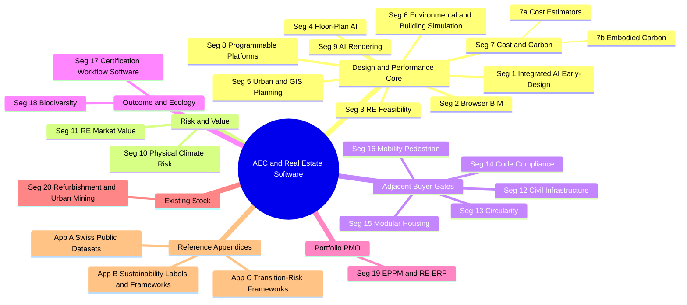

# Market Screening: Software & Platforms across the Construction Project Lifecycle

## Goal

A descriptive market scan of software tools, platforms, datasets, and frameworks that touch the Swiss federal construction project lifecycle — from existing-stock screening and site selection, through design, simulation, certification, cost, carbon, delivery, and portfolio management. **The goal is to map the landscape; this document does not make procurement recommendations.**

## Market map

## Segments at a glance

| # | Segment | Short description |
|---|---|---|
| 1 | [Integrated AI Early-Design / Site Planning Platforms](#segment-1--integrated-ai-early-design--site-planning-platforms) | Cloud platforms with integrated environmental analyses and BIM handoff. |
| 2 | [Browser-Native Concept BIM ("BIM 2.0")](#segment-2--browser-native-concept-bim-bim-20) | Multiplayer browser BIM aiming to replace SketchUp + Revit in early phases. |
| 3 | [Real-Estate Feasibility & Developer-Facing Tools](#segment-3--real-estate-feasibility--developer-facing-tools) | Parametric site-yield optimisation with financial KPIs baked into geometry. |
| 4 | [Generative Floor-Plan / Unit-Layout AI](#segment-4--generative-floor-plan--unit-layout-ai) | AI engines that emit valid floor plans from a massing + program brief. |
| 5 | [Urban / GIS-Driven Planning Platforms](#segment-5--urban--gis-driven-planning-platforms) | GIS + design + scenario analytics for urban-scale projects and approvals (merged from former 5 + 6). |
| 6 | [Environmental & Building Performance Simulation](#segment-6--environmental--building-performance-simulation) | Rhino-GH ecosystem + specialist CFD/wind + daylight/energy (merged from former 7 + 8 + 9). |
| 7 | [Early-Stage Cost & Embodied-Carbon Estimators](#segment-7--early-stage-cost--embodied-carbon-estimators) | Cost (7a: BKI, Keevalue, CostX) and Carbon (7b: One Click LCA, Preoptima, EC3) — distinct buyers. |
| 8 | [Programmable / Developer-Platform Plays](#segment-8--programmable--developer-platform-plays) | Cloud platforms exposing generative-design APIs / SDKs (Hypar, Speckle, ShapeDiver). |
| 9 | [Generative AI Rendering / Text-to-Image](#segment-9--generative-ai-rendering--text-to-image) | Diffusion-model image generators for concept renderings. |
| 10 | [Physical Climate Risk & Catastrophe Modelling](#segment-10--physical-climate-risk--catastrophe-modelling) | Commercial vendors (Swiss Re CatNet, Moody's RMS, Climate X, Jupiter, First Street) + the underlying models (CLIMADA, ERM-CH23). |
| 11 | [Real-Estate Market Value & Transaction Intelligence](#segment-11--real-estate-market-value--transaction-intelligence) | AVMs, CRE transaction data, market analytics (Wüest Partner, IAZI, PriceHubble, CoStar, MSCI RCA). |
| 12 | [Civil / Infrastructure Concept Design](#segment-12--civil--infrastructure-concept-design) | Conceptual modelling of site civil works (grading, utilities, access roads). |
| 13 | [Circularity & Material Passports](#segment-13--circularity--material-passports) | Per-project material catalogues for reuse, residual-value, and circularity reporting. |
| 14 | [Code Compliance & Model Checking](#segment-14--code-compliance--model-checking) | Automated code research and BIM rule-based validation. |
| 15 | [Industrialized / Modular Housing Configurators](#segment-15--industrialized--modular-housing-configurators) | Generative platforms producing code-compliant modular multifamily schemes. |
| 16 | [Mobility & Pedestrian Analytics](#segment-16--mobility--pedestrian-analytics) | Transport-demand and pedestrian/crowd simulation at area or campus scale. |
| 17 | [Certification Workflow Software](#segment-17--certification-workflow-software) | Software products supporting LEED / BREEAM / WELL / DGNB / Minergie / Passivhaus certification workflows. |
| 18 | [Biodiversity & Ecological Analysis](#segment-18--biodiversity--ecological-analysis) | Emerging tools quantifying site / portfolio biodiversity outcomes. |
| 19 | [Enterprise Project Portfolio Management & RE ERP](#segment-19--enterprise-project-portfolio-management--re-erp) | Portfolio-grade systems of record for capital-project tracking + the SAP RE-FX / Planon real-estate ERP layer. |
| 20 | [Refurbishment / Renovation Portfolio Screening & Urban Mining](#segment-20--refurbishment--renovation-portfolio-screening--urban-mining) | Pre-project portfolio screening for retrofit-vs-demolish and material-recovery potential. |
| App. A | [Swiss Public Datasets & Federal Data Layers](#appendix-a--swiss-public-datasets--federal-data-layers) | Reference: geo.admin.ch, NCCS, BAFU, GWR, GEAK, Sonnendach, BAFU CO₂, Mobitool. |
| App. B | [Sustainability Labels & Frameworks](#appendix-b--sustainability-labels--frameworks) | Reference: SNBS, Minergie, DGNB, LEED, BREEAM, WELL, EDGE, GRESB, EU Level(s). |
| App. C | [Carbon Stranding & Transition-Risk Frameworks](#appendix-c--carbon-stranding--transition-risk-frameworks) | Reference: CRREM, PACTA-CH, NGFS, SSREI, PCAF, SBTi. |

## Summary
- The construction project software market organises into **20 vendor segments** along two axes: (a) **stage/scale of activity** (existing-stock / urban-mining screening → location intelligence & risk → site / urban planning → massing → unit layouts → environmental and building simulation → cost & embodied carbon → civil/infrastructure → certification & ecology → delivery / portfolio / PMO), and (b) **buyer** (architects, real-estate developers, planners, sustainability consultants, civil engineers, QS / cost planners, code consultants, lenders / insurers, certification assessors, ecologists, portfolio / asset-owner PMOs, renovation strategists, real-estate analysts). Alongside the vendor segments sit **three reference appendices** (Swiss public datasets, sustainability labels & frameworks, transition-risk frameworks) — *cited from* many segments rather than being markets themselves. No single segment, and no single vendor, covers the lifecycle end-to-end; the market is segmented around different buyer journeys.
- The most consolidated battleground is the "BIM 2.0 / browser-native concept design" cluster (Autodesk Forma, Snaptrude, Arcol, Motif, Qonic) where Autodesk's Spacemaker → Forma move has set the integration bar. But the **buyers who block or kill projects** sit outside that cluster — planners, civil engineers, insurers, QS, code consultants, certification assessors, portfolio PMOs, renovation strategists — and they buy from different vendors. Many of the most consequential Swiss-specific layers (swisstopo, ÖREB / BZO, KBOB, eBKP-H, GEAK, SNBS, GWR) are not first-class citizens in international platforms; the Swiss-domiciled productised players — **Luucy** (site / zoning), **Keevalue** (cost), **Madaster Switzerland** (circularity), **sumami / Salza / Bauteilnetz Schweiz** (circular marketplaces), **Swiss Re CatNet** (climate risk), **Wüest Partner / IAZI / Fahrländer / Geoimpact** (valuation), and the **NCCS / BAFU / swisstopo** federal data layers — are the most defensible answers where Swiss alignment matters.
- The clearest white spaces in the market are: (1) **regionally-aligned cost taxonomies** (eBKP-H, BKI, DIN 276) — none of the major design-stack tools support them out of the box; (2) **integrated multi-KPI dashboards** combining embodied carbon, operational energy, daylight, cost, and **physical climate risk** against Swiss benchmarks (KBOB, SNBS 2023.1, BAFU Gefahrenkarten, NCCS CH2025); (3) **data residency in Swiss-sovereign cloud**; (4) **Swiss code / zoning compliance automation** beyond BZO ingestion; (5) **commercial real-estate climate valuation** — no productised platform combines AVM-grade market value with integrated physical and transition risk in a single offering.
- Regulatory and standards context: the **revised EU EPBD** introduces life-cycle Global Warming Potential (GWP) disclosure for **larger new buildings from 2028** and **all new buildings from 2030**. Switzerland is not bound, but EU-aligned procurement (and the SNBS / KBOB direction) makes this the de-facto baseline. **IFC 4.3** is now published as **ISO 16739-1:2024** and is becoming the interoperability floor. The **RICS Whole Life Carbon Assessment (WLCA) Software Validation Programme (2nd edition, July 2025)** is emerging as a credibility test for LCA tools — **One Click LCA** is the first validated platform. **NCCS Climate Scenarios CH2025** has superseded CH2018 as the federal Swiss climate-projection baseline.

## Recent consolidations & shifts

Notable vendor M&A, rebrands, and product retirements over the past ~36 months — the events that materially changed who owns what in this market:

| Year | Event | Effect |
|---|---|---|
| 2016 | **Sefaira → Trimble** | Now bundled with SketchUp & Revit plugins. |
| 2019 | **MSCI → Datscha** | European CRE intelligence consolidated under MSCI; one of the largest 2019 European PropTech transactions. |
| 2019 | **Moody's → Four Twenty Seven**; 2021 **Moody's → RMS** | Climate physical-risk franchise consolidated; now Moody's RMS Climate Solutions — top-3 globally in physical climate risk. |
| 2020 | **Spacemaker → Autodesk** ($240M) | Spacemaker rebranded to Forma in 2023; existing subscribers migrated to Forma Site Design. |
| 2023 (May) | **Scout24 → Sprengnetter** (75 %, €75M) | DACH AVM + valuation-data rollup begins. |
| 2023 (May) | **SAP ↔ Planon partnership** | Planon Real Estate Management for SAP S/4HANA becomes the joint productised IWMS layer; SAP Cloud for Real Estate retired as a separate target architecture. |
| 2023 (Sept) | **2000-Watt-Areal → Minergie-Areal / SNBS-Areal** | BFE retired the 2000-Watt-Areal label (50 certified areals 2010–2023); harmonised under Trägervereinsvertrag with Minergie, NNBS-SNBS, GEAK. |
| 2023 | **DIVA-for-Rhino → ClimateStudio** (Solemma) | DIVA retired; ClimateStudio is the successor for daylight/energy on Rhino 6/7/8. |
| 2025 (Jan) | **cove.tool → cove** rebrand | Pivots to AI services; IP later acquired by ROOST, continued as open source per Cove Software July 2025 LinkedIn post. |
| 2025 | **Scout24 → bulwiengesa** | Commercial-real-estate data added to Scout24 group. |
| 2025 (Feb) | **MSCI ↔ Swiss Re partnership** | MSCI GeoSpatial Asset Intelligence integrates Swiss Re CatNet — physical-risk pairing analogous to JLL ↔ Jupiter (also 2025). |
| 2025 (Apr) | **C.Scale → Tally** (Building Transparency) | Whole-building Revit LCA tooling consolidation. |
| 2025 (Jul) | **One Click LCA — RICS WLCA validation** | First software validated under the RICS WLCA Software Validation Programme (2nd edition). |
| 2025 (Nov) | **Once For All → 2050 Materials** | Sustainability data layer consolidation. |
| 2026 (Apr) | **Verifi3D → Solibri** | Verifi3D acquired; verifi3d.com now redirects to Solibri Checkpoint. |
| 2026 (May) | **Delve (Sidewalk Labs) discontinued** | Features partially folded into Google Earth. |
| 2026 | **EvolveLAB → Chaos ecosystem** | Veras integrated under Chaos branding. |
| 2026 | **Sciforma → Planview** | Sciforma acquired; sciforma.com now redirects to Planview's acquisition page. |
| Ongoing | **JLL ↔ Jupiter Intelligence** | JLL embedded Jupiter physical climate-risk analytics in CRE workflows, mainstreaming asset-level climate risk in transactions. |

## Details

### Segment 1 — Integrated AI Early-Design / Site Planning Platforms

**Definition.** Cloud platforms that ingest GIS/site context, allow massing creation/import, run a suite of environmental analyses (sun, wind, noise, daylight, embodied carbon, operational energy), and feed a downstream BIM workflow. Differentiator: breadth of integrated analyses + Autodesk-class BIM handoff.

**Persona.** Architects in pre-design / SD; urban developers; municipal planners running competitions.

| Product | Hosting | Pricing | Integrations | Notable |
|---|---|---|---|---|
| **[Autodesk Forma Site Design](https://www.autodesk.com/products/forma)** | Cloud SaaS | $185/mo or $1,445/yr standalone; included in AEC Collection | Revit, Rhino, Dynamo, ACC, IFC/OBJ import | Sun-hours, rapid wind/noise (AI), microclimate, embodied carbon, operational energy |
| **[Forma Building Design](https://www.autodesk.com/products/forma)** (closed beta) | Cloud | TBD | Same Forma cloud layer | Schematic LOD 200–300; facade & interior layouts; GA expected 2026 |

**Maturity.** Mature/consolidating. Forma is the de-facto enterprise default for firms inside the Autodesk ecosystem. Sun hours was the most-used Forma analysis in 2025 per CreativeToolsAI's 2026 Q1 review.

### Segment 2 — Browser-Native Concept BIM ("BIM 2.0")

**Definition.** Multiplayer, browser-based design tools that aim to replace SketchUp + Revit in early phases with a single collaborative model carrying BIM data. Differentiator: real-time co-editing (Figma-like) + native BIM export.

**Persona.** Schematic-design teams, multidisciplinary studios doing client-facing iteration.

| Product | Hosting | Pricing | BIM/Export | Notes |
|---|---|---|---|---|
| **[Snaptrude](https://www.snaptrude.com)** | Cloud (browser) | Free; Pro $499/yr; Org $1,199/yr; Enterprise quote | Bidirectional Revit, Rhino, IFC, DWG | Real-time BOQ/FAR/GFA; "AI Copilot" |
| **[Arcol](https://www.arcol.io)** | Cloud (browser) | Free solo (no Revit export); Team $100/user/mo | Revit export; presentation Boards | ≈ $20M raised (Cowboy Ventures, Craft Ventures, Procore CEO Tooey Courtemanche, Figma CEO Dylan Field, John Lilly). |
| **[Motif](https://www.motif.io)** | Cloud (browser) | Quote/early access | Connects to Revit/Rhino | Founded by ex-Autodesk co-CEO Amar Hanspal |
| **[Qonic](https://www.qonic.com)** | Cloud (browser) | Quote | IFC, Revit | Belgian, ex-Bricsys team |
| **[Autodesk FormIt](https://formit.autodesk.com)** | Desktop + Web | Free Pro tier with AEC Collection | Revit Add-in | Older SketchUp competitor; some features now in Forma |

**Maturity.** Emerging. AEC Magazine consistently flags this as an "overheated and over-serviced" segment.

### Segment 3 — Real-Estate Feasibility & Developer-Facing Tools

**Definition.** Tools that optimise a parametric site for **yield** (units, GFA, NRSF, parking, pro forma) before architecture begins. Differentiator: financial KPIs (yield-on-cost, NRSF) baked into geometry.

**Persona.** Developers, GCs, architects acting as developer-pitch consultants.

| Product | Hosting | Pricing | Key feature |
|---|---|---|---|
| **[TestFit](https://www.testfit.io)** | Cloud | Site Solver paid (quote); Urban Planner has free tier | Pro forma + automatic parking/earthwork takeoffs; Revit + SketchUp + AutoCAD push; conceptual cost estimation (5.4 release) |
| **[Spacio](https://www.spacio.ai)** | Cloud SaaS | Free, Personal, Pro (no public USD) | Norway-centric, Norkart import; IFC/Rhino/SketchUp interop |
| **[Giraffe](https://www.giraffe.build)** | Cloud (browser) | Free tier; Core $1,000/yr/user; Portfolio $3,000/yr/user; Enterprise | GIS-first; live pro-forma metrics; IFC export |
| **[Archistar](https://www.archistar.ai)** | Cloud | Quote (~$299/mo+ tier reported) | Site-level feasibility; zoning-rule database (AU/NZ/UK) |
| **[Zenerate](https://zenerate.ai)** | Cloud | Enterprise quote | Multi-family yield; Korean origin |

**Maturity.** Consolidating. TestFit is dominant in US multi-family; Giraffe owns master-planning + GIS niche.

### Segment 4 — Generative Floor-Plan / Unit-Layout AI

**Definition.** AI engines that take a massing or boundary + program brief and emit valid floor plans (units, circulation, code compliance).

**Persona.** Architects in early SD for multi-family / mixed-use; developer-architects.

| Product | Hosting | Pricing | Output |
|---|---|---|---|
| **[Finch 3D](https://www.finch3d.com)** | Cloud (browser + Rhino/Revit/GH plugins) | Free; Basic €49/mo; Enterprise €12,000/yr for 3 seats | Graph-rule based; Revit/Rhino/GH; AI floor-plan generation gated to Enterprise/AI tier |
| **[ARCHITEChTURES](https://architechtures.com)** | Cloud (browser) | 7-day trial; quote-based | Real-time BIM model, parking layout, IFC + DXF; cost takeoff with user-input unit cost |
| **[Maket.ai](https://www.maket.ai)** | Cloud | Free 50 credits; Pro $20/mo (300 credits) | Residential 1–4 stories; DWG/DXF export "coming soon" |
| **[PlanFinder](https://planfinder.xyz)** | Cloud | Quote | Apartment layout AI, Rhino plugin |
| **[ArkDesign.ai](https://www.arkdesign.ai)** | Cloud | $30–$150/mo individual | Residential layouts |

**Maturity.** Emerging. Output quality varies; per illustrarch's 2026 review, "spatial logic errors are common" — manual review remains required.

### Segment 5 — Urban / GIS-Driven Planning Platforms

**Definition.** Web platforms and host-modeller plugins that fuse GIS + design + scenario analytics for urban-scale projects. Where the **planner / municipality buyer** lives, and the gate at which schemes are approved or refused before architecture begins. *(Merged from former Segments 5 and 6 — the standalone-platform / plugin-in-host distinction is a useful sub-axis, not a separate market.)*

**Persona.** Urban planners, municipal review staff, master-planners, federal Bauherrenvertretung doing zoning-bounded Baupotential studies.

| Product | Form factor | Hosting | Pricing | Notable |
|---|---|---|---|---|
| **[Luucy](https://www.luucy.ch)** | Standalone platform | Cloud SaaS (Swiss-based vendor, Zug/CH) | Free trial; commercial quote | **Swiss-native.** Parametric massing + Baupotential; native ingestion of swisstopo terrain, ÖREB cadastral restrictions, BZO zoning. Reported user base 150 clients / 6,000 users / 15,000 projects. **No BIM (IFC/Revit) roundtrip and no embodied-carbon / cost-taxonomy output advertised today** — verify at procurement. |
| **[Esri ArcGIS Urban](https://www.esri.com/en-us/arcgis/products/arcgis-urban)** | Standalone platform | Cloud (Esri) | ArcGIS quote-based | Formal zoning / parcel / land-use / public-engagement workflows; the most planner-grade product; companion to CityEngine. |
| **[Esri CityEngine](https://www.esri.com/en-us/arcgis/products/arcgis-cityengine)** | Desktop | Desktop (Win/Linux) + ArcGIS Pro | $2,200/yr (Pro) or $4,200/yr (Pro Plus); perpetual licenses discontinued June 2025 | Procedural CGA shape grammars; no environmental sim; FBX/USD/Datasmith exports. |
| **[Giraffe](https://www.giraffe.build)** | Standalone platform | Cloud (browser) | Free / Core $1,000/yr-user / Portfolio $3,000/yr-user | GIS-first; live pro-forma metrics; IFC export. Cross-listed with Segment 3. |
| **[VU.CITY](https://vu.city)** | Standalone platform | Cloud (browser + apps) | Quote (city-coverage-based) | 3D city-context twin for planning communication; SiteSolve feasibility module. **Coverage city-by-city** — Swiss footprint must be confirmed. |
| **[UrbanFootprint](https://urbanfootprint.com)** | Standalone platform | Cloud | Quote-only | US-focused parcel/scenario analytics for utilities, planners, real estate. |
| **[Modelur](https://modelur.com)** | Plugin | SketchUp + Rhino plugin | Subscription, USD-based | Excel LiveSync; CSV/DXF/IFC/KMZ exports; AgiliCity (Ljubljana). |
| **Urbano** | Plugin | Rhino / Grasshopper | Quote / educational | Network and flow analysis for urban design (vendor canonical URL pending verification). |
| **[Digital Blue Foam (DBF)](https://www.digitalbluefoam.com)** | Hybrid | Cloud + DBF Hub desktop | "Custom-made" enterprise pricing | DBF Hub syncs to Revit, Archicad, Rhino; multi-source GIS; AI generative design. |
| **[Cityform Lab (MIT) — UNA toolbox](https://cityform.mit.edu/projects/una-rhino-toolbox)** | Plugin | Free Rhino + ArcGIS plugin | Free / open-source | Pedestrian-route, accessibility, street-network analysis; research tool. |
| **Cityzenith SmartWorldOS** | Standalone | SaaS + on-prem | Quote | Digital-twin platform; **status uncertain** — possible asset transfer to "TwinUp"; verify before procurement. |
| **Delve (ex-Sidewalk Labs)** | — | — | — | **Discontinued May 2026**; features partially folded into Google Earth. |

**Swiss-context note.** **Luucy** is the only player in this segment with native, productised integration of Swiss federal/cantonal geodata (swisstopo, ÖREB, BZO). **ArcGIS Urban** can consume swisstopo via OGC services but is buyer-configured. **VU.CITY** is relevant only if a Swiss city has been modelled.

### Segment 6 — Environmental & Building Performance Simulation

**Definition.** The Rhino-Grasshopper-anchored simulation ecosystem plus its cloud successors and the daylight / energy / wind specialists. Differentiator: methodological transparency, validated engines (Radiance, EnergyPlus, OpenFOAM), and Rhino / Revit ecosystem fit. *(Merged from former Segments 7, 8 and 9 — same buyer, same Rhino+Revit+EnergyPlus/Radiance backbone, previously over-split.)*

**Persona.** Sustainability consultants, building physicists, daylight specialists, comfort consultants — increasingly architects with sustainability briefs.

#### 6a — Rhino-Grasshopper open-source ecosystem

| Product | Pricing | Engine | Coverage |
|---|---|---|---|
| **[Ladybug](https://www.ladybug.tools)** | Free / open-source | Custom | Weather, sun, radiation, comfort |
| **[Honeybee](https://www.ladybug.tools/honeybee.html)** | Free / open-source | Radiance + OpenStudio/EnergyPlus | Daylight, energy |
| **[Butterfly](https://www.ladybug.tools/butterfly.html)** | Free / open-source | OpenFOAM | CFD/wind |
| **[Dragonfly](https://www.ladybug.tools/dragonfly.html)** | Free / open-source | URBANopt | Urban energy |
| **[Pollination Cloud](https://www.pollination.solutions)** | Subscription | Cloud + Rhino + Revit + GH plugins | Native exports to EnergyPlus / OpenStudio / IES VE / DesignBuilder / IDA-ICE; gbXML/IFC |
| **[ClimateStudio (Solemma)](https://www.solemma.com/climatestudio)** | Subscription, free trial; commercial + educational tiers | RADIANCE + EnergyPlus | Daylight, glare, energy, comfort; LEED/BREEAM/EN 17037; Revit-to-Rhino exporter |
| **DIVA-for-Rhino** | Retired (no new sales) | — | Predecessor to ClimateStudio |

#### 6b — Specialist wind / CFD / microclimate

| Product | Hosting | Pricing | Notable |
|---|---|---|---|
| **[Orbital Stack](https://orbitalstack.com)** | Cloud | Credit-based (6-month min); AI sims + Rapid CFD credits | RWDI-backed; designed for early design |
| **[SimScale](https://www.simscale.com)** | Cloud (browser) | Subscription tiers | General CFD + structural; AEC pricing tier |
| **[ENVI-met](https://www.envi-met.com)** | Desktop | Subscription tiers | Microclimate / urban heat / vegetation |
| **[Autodesk CFD](https://www.autodesk.com/products/cfd)** | Desktop | $1,915/yr | General-purpose CFD; building & MEP |

#### 6c — Specialist daylight / energy at concept stage

| Product | Hosting | Pricing | Notable |
|---|---|---|---|
| **[Sefaira (Trimble)](https://sketchup.trimble.com/products/sefaira)** | Cloud + SketchUp + Revit plugins | Subscription via Trimble | Annual energy + daylight; HVAC sizing |
| **[Autodesk Insight](https://insight.autodesk.com)** | Revit-native + cloud | Included with AEC Collection | Revit-integrated performance and total-carbon analysis; the in-Revit alternative to Forma |
| **[IES VE](https://www.iesve.com)** | Desktop / cloud | Quote | Full TM52/TM54 compliance |
| **[VELUX Daylight Visualizer](https://www.velux.com)** | Desktop | Free | Daylight factor; quick studies |

**Maturity.** Mature. This is the most credible analytical stack for a federal real-estate organisation that prioritises method transparency and standards alignment.

### Segment 7 — Early-Stage Cost & Embodied-Carbon Estimators

**Definition.** Tools that convert early geometry into **cost** estimates or **embodied-carbon** estimates. The two halves sell to **different buyers** (QS / project controls / Bauherrenvertretung vs. sustainability consultants), use **different data taxonomies** (DIN 276 / eBKP-H / BKI Kennwerte vs. EN 15978 / ISO 14040 / KBOB), and consolidate at **different speeds**. Both are exposed to the **EU EPBD 2028 / 2030 GWP disclosure regime** at the carbon end and to procurement-level cost transparency rules at the cost end. The Swiss **eBKP-H / SIA 416 / KBOB gap** lives across both halves.

#### Segment 7a — Early-Stage Cost Estimators

**Persona.** Quantity surveyors, cost consultants, Bauherrenvertretung, federal/canton project managers, architects in SD-stage cost-checks. In DACH the buyer is often the **Architektenkammer-affiliated cost-data buyer** (BKI subscriber) or the **BIM-coordinator-driven cost-modelling buyer** (DBD-BIM, CostX).

| Product | Origin | Hosting | Pricing | Notes |
|---|---|---|---|---|
| **[Keevalue](https://www.keevalue.ch)** | **Switzerland** | Cloud SaaS (CH vendor) | Not publicly listed | Baukostenschätzung / Baukostenberechnung "Für Architekten, Bauherren & Co." Swiss-domiciled vendor; verify eBKP-H / SIA 416 alignment, hosting region, and BIM intake at procurement. |
| **[BKI Baukosteninformationszentrum](https://bki.de)** | Germany (Architektenkammer-affiliated, Stuttgart) | Desktop + emerging web (**KoRa**, launching June 2026) | Tiered; free test versions; publications €92–€1,247+ | **BKI Kostenplaner** is the de-facto Architektenkammer cost-planning tool in DE; **BKI Objektdaten** is the canonical building-cost reference database; uses **DIN 276**. Companion tools: BKI Energieplaner (GEG), BKI Honorarermittler (HOAI), BKI IFC-Mengenermittler. |
| **[DBD-BIM (Dynamische BauDaten)](https://www.dbd.de/dbd-bim/)** | Germany (Dr. Schiller & Partner / DBD) | Online + offline | Free 7-day test; commercial quote | DIN 276 + STLB-Bau VOB + DIN BIM Cloud; real-time cost recalculation as properties change; integrates with 24+ AEC apps. |
| **[RIB CostX (iTWO)](https://www.rib-software.com)** | Global (RIB / Schneider) | On-prem + SaaS | Quote-only | IFC + RVT; 5D BIM takeoff/estimating; supports the EC3 carbon-rate library. |
| **[Nomitech CostOS](https://www.nomitech.com)** | Global | Cloud + desktop | Quote | Feasibility → detailed estimating; GIS/2D/BIM continuum; **classification-flexible engine** — most likely commercial product re-configurable to eBKP-H. |
| **[Beck Technology DESTINI Estimator](https://beck-technology.com)** | US | Cloud (SOC 2) + legacy desktop | Quote-only | 2D/3D takeoff + estimating; DESTINI Profiler is the conceptual 5D companion. |
| **[TestFit](https://www.testfit.io)** (cost module) | US | Cloud | Subscription | Cross-listed with Segment 3; pro-forma-grade, not 5D-estimator-grade. |

**Non-exhaustive.** The DACH cost-data market has many smaller specialised vendors (NPK / CRB element catalogues, pom+ services, cantonal building-cost portals, in-house Excel-based Kennwert databases at the larger Generalplaner) that are not productised as platforms.

#### Segment 7b — Embodied-Carbon Estimators & Optioneering

**Persona.** Sustainability consultants, Nachhaltigkeitskoordinatoren, architects with sustainability responsibility, ESG-driven owner reps. The buyer is increasingly the **owner** under EPBD 2028 / 2030.

| Product | Hosting | Pricing | Notes |
|---|---|---|---|
| **[One Click LCA](https://www.oneclicklca.com)** | Cloud SaaS + plugins | Subscription, quote-based | Revit, Rhino+GH, Tekla, IES VE, DesignBuilder, IFC, Forma extension; EN 15978/15804, ISO 14040/14067, **RICS WLCA validated** (1st in world, July 2025), EU Level(s), DGNB. |
| **[Preoptima](https://www.preoptima.com)** | Cloud SaaS | Subscription / quote | **Decision-centric** carbon comparison of structural / envelope options at concept stage (timber / hybrid / concrete); complements One Click LCA. |
| **[Building Transparency EC3](https://www.buildingtransparency.org/ec3)** | Cloud (free) | Free + open access | A1–A3 EPD-based embodied carbon; tallyCAT Revit plugin; integrates ACC, Procore, cove, One Click LCA. |
| **[2050 Materials](https://2050-materials.com)** | Cloud + REST API | Free web + commercial API | 150,000+ products, 100,000+ EPDs; acquired by Once For All Group in November 2025. |
| **[cove (ex-cove.tool)](https://cove.inc)** | Cloud | Service fees | IP acquired by ROOST and continued as open source. |

**Materials / Reference-Data Layer (feeds both 7a and 7b).** A handful of catalogues sit alongside the estimator tools as authoritative **product / material reference databases** — *data layers, not engines*:

| Source | Origin | What it is | Use |
|---|---|---|---|
| **[werk-material.online](https://werk-material.online)** | Switzerland | Swiss building-materials database (catalogue, not estimator) | Reference layer for materials selection, specification, downstream LCA/cost work. |
| **[KBOB Ökobilanzdaten](https://www.kbob.admin.ch/de/oekobilanzdaten-im-baubereich)** | Switzerland (federal) | Authoritative Swiss LCA dataset | The reference dataset One Click LCA / Preoptima / Bauteilkatalog must speak to be defensibly Swiss. |
| **[Lesosai](https://lesosai.com)** / Bauteilkatalog | Switzerland (BFE / academic-industrial) | KBOB-aligned building-element LCA datasets | De-facto fallback when an international LCA tool can't natively load KBOB. |

**Critical Swiss-cost-and-carbon gap.** No international cost tool is natively eBKP-H-aware. **Keevalue** (CH-native), **BKI Kostenplaner** + **DBD-BIM** (DACH DIN 276 anchors), and **CostOS** (classification-flexible global) are the main candidates today; all require buyer-side configuration. For carbon: **One Click LCA + custom KBOB dataset** is the closest plug-and-play candidate; **Bauteilkatalog / Lesosai** remain the de-facto KBOB-native fallback.

### Segment 8 — Programmable / Developer-Platform Plays

**Definition.** Cloud platforms exposing a generative-design API/SDK so firms can encode their own logic.

| Product | Hosting | Pricing | Notable |
|---|---|---|---|
| **[Hypar](https://hypar.io)** | Cloud | Free / Pro / Enterprise | C#/Python functions; Revit/Rhino/IFC/DWG export; $8.28M raised across 4 rounds; most recent $5.5M Series A June 2023 led by Brick & Mortar Ventures. |
| **[Speckle](https://speckle.systems)** | Cloud + self-host (open source) | Free / Workspaces | Data hub / connectors across BIM apps; Speckle Automate beta. |
| **[ShapeDiver](https://www.shapediver.com)** | Cloud | Subscription tiers | Grasshopper-as-a-service web embedding. |

### Segment 9 — Generative AI Rendering / Text-to-Image

**Definition.** Diffusion-model image generators producing concept renderings from massing geometry or text prompts. **Presentation layer**, not analytically rigorous.

| Product | Hosting | Pricing | Hosts |
|---|---|---|---|
| **[Veras (EvolveLAB / Chaos)](https://www.evolvelab.io/veras)** | Plugin + web | $149/yr student tier; commercial subscription | Revit, SketchUp, Rhino 7/8, Forma, Archicad 28, Vectorworks |
| **[ARK / ArkoAI](https://arko.ai)** | Plugin | Subscription tiers | Revit, SketchUp |
| **[LookX](https://www.lookx.ai)** / **[ArchiVinci](https://www.archivinci.com)** | Web | Freemium | Web-based |
| **[Midjourney](https://www.midjourney.com)** / **[Stable Diffusion](https://stability.ai)** / **[DALL·E](https://openai.com/dall-e-3)** | Web | Various | Generic; widely used as workaround |

### Segment 10 — Physical Climate Risk & Catastrophe Modelling

**Definition.** Asset-level and portfolio-level physical climate-risk analytics and natural-catastrophe modelling — flood, wind, heat, wildfire, subsidence, seismic. A scheme can be financeable in form but uninsurable; this is now an entry-stage diligence gate, not a post-design afterthought. *(Merged from former Segment 13 (commercial vendors) and former Segment 23c (academic / open-source models) — same buyer, the commercial-wrapper-vs-model distinction was artificial.)*

**Persona.** Real-estate investors, lenders, insurers, ESG / portfolio teams, owner risk leads. Increasingly architects and PMs as resilience and disclosure requirements bite.

#### 10a — Commercial physical-risk vendors

| Product | Origin | Hosting | Pricing | Notable |
|---|---|---|---|---|
| **[Swiss Re CatNet](https://www.swissre.com)** | **Switzerland (Swiss Re)** | Web atlas + API | Basic / Premium / API tiers | 20+ years; 10,000+ users; **MSCI partnership Feb 2025** (integrated into MSCI GeoSpatial Asset Intelligence). Swiss-origin major player. |
| **[Munich Re Location Risk Intelligence (LRI)](https://www.munichre.com)** | Germany (Munich Re) | Cloud SaaS | Quote | Portfolio + asset hazard to 2100; built on NatCatSERVICE database; dedicated real-estate-industry product. |
| **[Moody's RMS Climate Solutions](https://www.rms.com)** | US (Moody's; RMS acquired 2021, Four Twenty Seven 2019) | Cloud SaaS | Quote | Top-3 globally; integrated climate-risk franchise. |
| **[Climate X](https://www.climate-x.com)** | UK | Cloud SaaS | Quote | CRE-oriented asset-level physical-risk analytics. |
| **[Jupiter Intelligence](https://jupiterintel.com)** | US | Cloud SaaS | Quote | Portfolio + compliance workflows; JLL strategic expansion 2025. |
| **[First Street](https://firststreet.org)** | US | Cloud + API | Quote; freemium lookup | Property-level risk + financial-impact screening; deepest US data, increasing global coverage. |
| **[MSCI GeoSpatial Asset Intelligence](https://www.msci.com)** | US (MSCI) | Cloud SaaS | Quote | AI-powered location risk; integrates Swiss Re CatNet since Feb 2025. |
| **[Verisk AIR Worldwide](https://www.air-worldwide.com)** | US (Verisk) | Cat-modelling (Touchstone) | Quote | Top-3; underpins insurer pricing globally. |
| **[CoreLogic CRE Cat Risk](https://www.corelogic.com)** | US | Cat-modelling + property data | Quote | Top-3; US-CRE-dominant. |
| **[JBA Risk Management](https://www.jbarisk.com)** | UK | Flood specialist | Quote | EU + global flood-cat-modelling reference. |
| **[CelsiusPro](https://www.celsiuspro.com)** | **Switzerland (Zurich)** | Parametric insurance + advisory | Quote | Climate-resilient real-estate financing. |

#### 10b — Open-source / academic multi-hazard models & data

| Model | Provenance | Notable |
|---|---|---|
| **[CLIMADA](https://climada.ethz.ch)** | **ETH Zurich** | "Most comprehensive open-source" multi-hazard impact model (tropical cyclones, floods, droughts, heat, wind, wildfire); powers EIOPA's CLIMADA-App for European insurance supervision. |
| **[ERM-CH23](http://www.seismo.ethz.ch)** | Switzerland (SED + federal) | Swiss national earthquake-risk model covering 2M+ buildings. Authoritative Swiss seismic-risk dataset. |
| **[OpenQuake](https://www.globalquakemodel.org/openquake)** | GEM Foundation | Gold standard for seismic risk globally; 200+ countries, 3,500+ building typologies. |
| **[Oasis LMF](https://oasislmf.org)** | Insurance industry consortium | Open-source catastrophe-modelling platform aggregating 100+ models from 21+ providers; BSD-licensed with REST API. |
| **[JRC Flood Hazard Maps](https://data.jrc.ec.europa.eu/collection/id-0054)** | EU Joint Research Centre | Flood inundation, 100m resolution, 10–500-year return periods; most accessible EU-wide flood dataset. |
| **[WRI Aqueduct](https://www.wri.org/aqueduct)** | World Resources Institute | Water risk, drought, flood hazard; global water-stress mapping. |

**Swiss-context note.** Authoritative Swiss climate-hazard data lives in **BAFU Gefahrenkarten**, cantonal Gefahrenkarten via **geodienste.ch**, and **NCCS Climate Scenarios CH2025** (superseding CH2018). Commercial vendors typically do not consume these as primary inputs — cross-validation against federal layers is essential. See **Appendix A** for the full Swiss public-dataset inventory.

### Segment 11 — Real-Estate Market Value & Transaction Intelligence

**Definition.** Real-estate valuation (AVMs), transaction analytics, and CRE market intelligence. **Distinct buyer** from Segment 10: valuers, lenders, portfolio managers, transaction teams.

**Persona.** Real-estate analysts, federal Bauherrenvertretung for portfolio prioritisation, lenders / mortgage banks, sovereign-wealth and pension-fund property investors, valuation surveyors.

| Vendor | Origin | Type | Notable |
|---|---|---|---|
| **[Wüest Partner](https://www.wuestpartner.com)** | **Switzerland** | Research + AVM + index data | Swiss real-estate market intelligence leader; data feeds federal/cantonal valuation work. |
| **[IAZI / CIFI](https://www.iazicifi.ch)** | **Switzerland** | AVM + indices | Swiss Real Estate Index family; widely cited in Swiss institutional benchmarking. |
| **[PriceHubble](https://pricehubble.com)** | **Switzerland** (now international) | Cloud AVM + market analytics | Swiss-origin; operates across DACH/EU/parts of Asia. |
| **[Fahrländer Partner](https://www.fpre.ch)** | **Switzerland** | RE valuation + market modelling | Swiss research + AVM. |
| **[Geoimpact](https://geoimpact.ch)** | **Switzerland** | Location-intelligence platform | Building-level data + analytics on Swiss geodata. |
| **[Sprengnetter Group](https://www.sprengnetter.de)** | Germany (Bad Neuenahr-Ahrweiler, 1978; ~250 employees) | AVM + valuation + mortgage appraisal + ESG | **Acquired by Scout24 July 2023 (75 %, €75M)**; Sprengnetter Austria GmbH reaches DACH. |
| **[bulwiengesa](https://www.bulwiengesa.de)** | Germany | Commercial real-estate data + valuations | **Acquired by Scout24 early 2025**. |
| **[ImmoScout24 (Scout24)](https://www.immobilienscout24.de)** | Germany / Austria | Portal-grade consumer AVM | Powered by Sprengnetter data; 19M+ monthly users. |
| **[MSCI Real Capital Analytics (RCA)](https://www.msci.com/real-capital-analytics)** | US (140+ countries) | Investment-transaction data + analytics | Foundational global CRE-transaction database. |
| **[MSCI Datscha](https://www.msci.com)** | Sweden / Finland / UK / Norway | CRE intelligence, 35M+ properties | MSCI-owned since December 2019. |
| **[VTS](https://www.vts.com)** | US (NYC) | Leasing + asset management; $125.5M ARR 2025; 13B sq ft active demand data | US-CRE leader. |
| **[CoStar Group](https://www.costar.com)** | US (global expansion) | CRE data + analytics + portals | Dominant US CRE intelligence; active European expansion. |
| **[Green Street Advisors](https://www.greenstreet.com)** | US | CRE research + benchmarks | Listed for completeness. |

> **Notable market gap.** **No commercial real-estate climate valuation tool exists** combining AVM-grade market value with integrated physical-risk and transition-risk pricing in a single offering. The highest-value white space identified in this screening.

### Segment 12 — Civil / Infrastructure Concept Design

**Definition.** Conceptual modelling of site civil works — access, grading, earthworks, stormwater, utilities, road corridors — that often determines feasibility before architecture begins.

**Persona.** Civil engineers, land-development engineers, public-infrastructure owners.

| Product | Hosting | Pricing | Notable |
|---|---|---|---|
| **[Autodesk InfraWorks](https://www.autodesk.com/products/infraworks)** | Desktop + cloud | Included in AEC Collection | Concept-stage civil + transportation + utility; Revit and Civil 3D handoff |
| **[Bentley OpenSite+](https://www.bentley.com/software/opensite-design)** | Desktop + cloud | Quote | AI-assisted land-development site design; grading + stormwater focus |
| **[Bentley OpenRoads ConceptStation](https://www.bentley.com/software/openroads-conceptstation)** | Desktop | Quote | Early roadway / bridge concepting with traffic-aware logic |

**Why it matters.** Federal sites with difficult access, steep grading, or constrained utilities can be ruled out — or have their cost envelope blown — before any architectural concept matters. None of the design-stack tools (Forma, Giraffe, Luucy) replace civil concept modelling.

### Segment 13 — Circularity & Material Passports

**Definition.** Platforms that catalogue and value the material composition of buildings to enable reuse, residual-value calculation, and circularity reporting.

**Persona.** Public owners (esp. federal / cantonal), ESG-driven private owners, circular-construction consultancies. Complements but does not replace LCA tools (Segment 7b).

| Product | Hosting | Pricing | Notable |
|---|---|---|---|
| **[Madaster](https://madaster.com)** ([Switzerland: madaster.ch](https://madaster.ch)) | Cloud, multi-region incl. **Madaster Switzerland** | Subscription / quote | Material passports, circularity index, environmental impact, residual-value; IFC + Excel intake; Swiss platform operated locally |

**Why it matters.** Swiss federal direction on circular economy (Bundesrat Aktionsplan Kreislaufwirtschaft) is pushing public owners toward building-level material accounting. Madaster is the only mature productised player with an explicit Swiss platform.

> **Cross-reference.** Segment 13 covers material passports **per project, during and after construction**. The **portfolio-scale "should we refurbish, deep-retrofit, or demolish?" screening question** — including upstream urban-mining estimation on existing stock — is handled in **Segment 20**. Swiss circular marketplaces (sumami, Salza, Bauteilbörse Basel, Bauteilnetz Schweiz) also sit primarily in Segment 20.

### Segment 14 — Code Compliance & Model Checking

**Definition.** Tools that automate code research (text → applicable rules) and model checking (geometry → rule violations).

**Persona.** Architects (code research), BIM coordinators (model validation), specialist code consultants.

| Product | Hosting | Pricing | Notable |
|---|---|---|---|
| **[UpCodes / UpCodes Copilot](https://up.codes)** | Cloud (browser) | Subscription tiers | Jurisdiction-specific AI code research; US-centric coverage today |
| **[Verifi3D (now Solibri Checkpoint)](https://www.solibri.com/checkpoint)** | Cloud (browser) | Quote | BIM model validation; rule-based IFC checking. **Acquired into Solibri** — the verifi3d.com domain now redirects to Solibri's Checkpoint product page. |
| **[Solibri](https://www.solibri.com)** | Desktop + cloud | Subscription | Mature rule-based model checking; widely used in EU; supports custom rulesets |

**Swiss gap.** None of the international code tools natively cover **SIA norms** or cantonal building regulations (BZO/BNO). Solibri's strength is its configurability — Swiss rulesets are theoretically achievable but a buyer-side build. **Luucy** partially handles BZO at the zoning envelope layer only, not at the building-code layer.

### Segment 15 — Industrialized / Modular Housing Configurators

**Definition.** Generative platforms producing code-compliant multifamily schemes built around an industrialized kit-of-parts, with cost, carbon, and BIM outputs in a single run.

**Persona.** Multifamily developers, public-housing programmes, modular firms. Thin market — currently dominated by one productised vendor.

| Product | Hosting | Pricing | Notable |
|---|---|---|---|
| **[Modulous TESSA](https://www.modulous.com)** | Cloud | Quote | Generates optimized multifamily schemes with cost plans, A1–A3 carbon metrics, Revit / IFC exports |

### Segment 16 — Mobility & Pedestrian Analytics

**Definition.** Transport-demand modelling and pedestrian/crowd capacity simulation at area, campus, or facility scale.

| Product | Hosting | Pricing | Notable |
|---|---|---|---|
| **[PTV Visum](https://www.ptvgroup.com/en/products/ptv-visum)** | Desktop | Subscription | Macroscopic transport-demand modelling; CH + EU public-sector standard |
| **[Bentley LEGION](https://www.bentley.com/software/legion-simulator)** | Desktop / cloud | Quote | Pedestrian / crowd simulation for stations and dense nodes |

**Relevance.** Specialist; invoked for federal projects with significant public flow (SBB station-adjacent buildings, large administrative campuses).

### Segment 17 — Certification Workflow Software

**Definition.** **Software products** that support building-label certification workflows — submission portals, scorecard tools, criteria-evidence management. Distinct from Segment 7b (carbon estimators) and Segment 6c (energy tools), which **feed** certifications but do not themselves certify.

> See **Appendix B** for the full registry of sustainability labels and frameworks (SNBS, Minergie, DGNB, LEED, BREEAM, WELL, Passivhaus, EDGE, GRESB, EU Level(s)). This segment lists only the **software products** people license, deploy, or interact with.

**Persona.** Sustainability consultants pursuing certification credits, certification assessors, owner sustainability leads.

| Product | Operator | Type | Notes |
|---|---|---|---|
| **[LEED Online](https://www.usgbc.org/leed)** | USGBC + GBCI | Web platform — full submission, review, scorecard, certification | Mature; global benchmark for cloud certification workflow. |
| **[BREEAM Projects / In-Use](https://breeam.com)** | BRE Global + national partners | Assessor-driven web platform | EU-common; UK-dominant. |
| **[WELL Online](https://www.wellcertified.com)** | IWBI | v2 scorecard + post-occupancy verification | Health/wellness focus. |
| **[DGNB System tooling](https://www.dgnb.de)** | DGNB | Criteria matrix (Excel + emerging web); independent assessor model | Cross-fed by One Click LCA, EC3, Madaster. |
| **[Minergie online portal](https://www.minergie.ch)** | Verein Minergie | Module-based application workflow; SIA 380/1 alignment | Swiss energy + (for Eco) ecology + materials anchor; federal default. |
| **SNBS Hochbau Pre-Check Tool** ([snbs-hochbau.ch](https://www.snbs-hochbau.ch)) | NNBS | Document-based criteria scorecard | The Swiss-federal anchor; document-based today; 2026+ digital platform is a watch item. |
| **klimaaktiv online tool** | Austrian Klimaschutzministerium | Cloud declaration tool; 1000-point system | Often required for Austrian Wohnbauförderung. |
| **PHPP / designPH** | Passive House Institute, Darmstadt | Excel (PHPP) + SketchUp plug-in (designPH) | Passivhaus envelope-energy gold standard; cited in Minergie-P / SIA 380/1. |
| **QNG documentation tools** | German federal (DENA / BBSR) | Documentation + audit | Required for elevated KfW funding. |
| **[GRESB platform](https://www.gresb.com)** | GRESB BV | Annual portfolio-level ESG benchmarking | **Portfolio scale, not project scale.** |

**Cross-references.** **One Click LCA, EC3, Sefaira, ClimateStudio, Madaster, 2050 Materials** all *feed* certifications — they are evidence sources, not certification platforms. **No general-purpose "certification meta-platform"** aggregates submissions across SNBS + DGNB + LEED + Minergie + BREEAM; each label is its own ecosystem.

### Segment 18 — Biodiversity & Ecological Analysis

**Definition.** Quantifying and improving biodiversity / ecological outcomes at site or portfolio level. Genuinely **emerging** — most AEC biodiversity work remains consultant-led with internal spreadsheets and GIS overlays.

**Persona.** Ecologists, landscape architects, sustainability consultants, public-realm planners. For BBL: SNBS / Minergie-Eco ecology criteria and federal NHG (Natur- und Heimatschutzgesetz) obligations.

| Tool / Resource | Origin | Type | Notes |
|---|---|---|---|
| **[Restor](https://restor.eco)** | **ETH Zurich** (Crowther Lab spin-off; Restor Eco AG) | Open-data web platform; 50,000+ project sites; Google-funded; Earthshot finalist | **Swiss-origin; UN Decade on Ecosystem Restoration partner.** |
| **[Defra Statutory Biodiversity Metric](https://www.gov.uk/government/publications/statutory-biodiversity-metric-tools-and-guides)** | UK government (Defra) | Free downloadable Excel calculator | The official UK BNG calculation tool, statutory since 2024; cited globally as reference. |
| **[IBAT](https://www.ibat-alliance.org)** | IUCN + UNEP-WCMC + BirdLife + CI | Web platform + API | Authoritative biodiversity-data backbone (Red List + WDPA + KBA); most-used ESG/finance/AEC screening tool. |
| **[ENCORE](https://www.encorenature.org)** | NCFA + UNEP-WCMC + Global Canopy | Free web tool | Biodiversity & ecosystem-services risk for finance. |
| **[WWF Biodiversity Risk Filter](https://riskfilter.org/biodiversity)** | WWF | Free web tool | Corporate biodiversity screening; TNFD-aligned. |
| **Global Biodiversity Score (GBS)** | CDC Biodiversité (FR) | Corporate footprint metric (MSA·km²) | Biodiversity-footprint counterpart to carbon footprint. |
| **i-Tree** | US Forest Service | Free desktop + web | Urban-tree benefits valuation (CO₂, stormwater, pollutant removal); used by landscape architects. |
| **[ENVISION](https://sustainableinfrastructure.org/envision/)** | ISI (Institute for Sustainable Infrastructure) | Sustainability rating framework for infrastructure | Project-rating framework; mostly NA civil/infra. |
| **[iNaturalist](https://www.inaturalist.org)** / **[GBIF](https://www.gbif.org)** / **[InfoSpecies (CH)](https://www.infospecies.ch)** | Public / CC ecology | Species occurrence databases | Reference data layers; **InfoSpecies** is the Swiss federal data clearing house. |

**Swiss-context note.** For BBL today, biodiversity sits inside SNBS / Minergie-Eco criteria and NHG-compliance assessment, not in a dedicated tool. Realistic 2-year posture: consultant-led ecology + InfoSpecies/BAFU GIS overlays on Luucy or ArcGIS Urban, with TNFD and the EU Nature Restoration Law as the watch-list for emerging procurement-disclosure requirements.

### Segment 19 — Enterprise Project Portfolio Management & RE ERP

**Definition.** Portfolio- and PMO-grade systems of record that track projects across an entire owner portfolio (status, SIA phase, milestones, risks, cost, schedule, resources, KPIs, executive reporting) — **plus** the real-estate ERP layer beneath them (SAP RE-FX + Planon for SAP). The **system of record above and beneath everything else.**

**Persona.** Owner Bauherrenvertretung, public-sector PMOs, real-estate portfolio managers, federal political-reporting users, controlling teams.

#### 19a — Capital-projects PMO / EPPM (project-level tracking)

| Product | Hosting | Pricing | Notable |
|---|---|---|---|
| **[Oracle Primavera P6 + Unifier + Aconex](https://www.oracle.com/construction-engineering/primavera-p6/)** | Cloud + on-prem | Enterprise quote | Global enterprise / government default for capital programmes; deep schedule + risk + cost + contract admin. |
| **[Microsoft Project / Project for the Web / Project Online](https://www.microsoft.com/en-us/microsoft-365/project/project-management-software)** | Cloud + on-prem | M365 licensing | Default in Microsoft-shop organisations; lower ceiling than Primavera. |
| **[Procore Capital Projects + Portfolio Financials](https://www.procore.com)** | Cloud SaaS | Enterprise quote | Construction-native PMO; strong on schedule/cost/issues; weaker on early design + KPI dashboards. |
| **[Autodesk Construction Cloud (ACC)](https://construction.autodesk.com)** | Cloud SaaS | Subscription | Tight Revit + Forma integration; portfolio dashboards expanding. |
| **[InEight](https://ineight.com)** | Cloud SaaS | Enterprise quote | Capital-project PMO; cost-and-schedule integrated; large infrastructure-owner footprint. |
| **[Kahua](https://www.kahua.com)** | Cloud SaaS (FedRAMP + StateRAMP) | Enterprise quote | **US-federal-government PMIS**; low-code platform; closest commercial equivalent to a buildable federal Cockpit. |
| **[Aurigo Masterworks](https://www.aurigo.com)** | Cloud SaaS | Enterprise quote | **Capital planning + portfolio for public-sector owners** (cities, counties, states); closer to BBL's actual workload than Procore/ACC. |
| **[Trimble e-Builder / Unity Construct](https://www.e-builder.net)** | Cloud SaaS | Enterprise quote | **Owner-focused** capital-improvement programmes; US public sector strong; alternative to Primavera for owner-side PMOs. |
| **[Mastt](https://www.mastt.com)** | Cloud SaaS | Subscription tiers | Australian (2019); lightweight PMIS for PMO/owner-rep teams; AI-assisted reporting. |
| **[Planview](https://www.planview.com)** / **Sciforma** (acquired by Planview) / **[Cora PPM](https://corasystems.com)** | Cloud SaaS | Enterprise quote | Generic enterprise PPM; Cora PPM has UK/EU public-sector adoption. |
| **[Asta Powerproject (Elecosoft)](https://www.elecosoft.com/asta-powerproject/)** | Desktop + cloud | Quote | UK construction-PMO favourite; schedule-strong. |
| **[PMWeb](https://www.pmweb.com)** | Cloud + on-prem | Enterprise quote | Capital-projects PMO; common in Middle-East / public-sector procurement. |
| **[OpenProject](https://www.openproject.org)** | Cloud + on-prem (open source) | Free / Enterprise | **EU-region self-hostable** (German vendor) — sovereignty-friendly. |
| **[Smartsheet](https://www.smartsheet.com)** / **[Monday.com](https://monday.com)** / **[Wrike](https://www.wrike.com)** / **[ClickUp](https://clickup.com)** | Cloud SaaS | Per-user subscriptions | Lightweight PPM; not capital-project-grade for federal portfolios. |
| **Custom / federal "Cockpit" tools** (incl. pm-cockpit) | Varies | n/a | Public-administration thin dashboards on top of SAP / Excel / GIS; this prototype is in that pattern. |

#### 19b — Real-estate ERP / IWMS (asset-level master data)

| Product | Hosting | Pricing | Notable |
|---|---|---|---|
| **[SAP S/4HANA Real Estate Management (RE-FX)](https://www.sap.com)** | On-prem + Private Cloud + S/4HANA Cloud (Lease only in Public Cloud) | SAP enterprise licensing | **Material for BBL given the SUPERB programme**; master data + architectural/usage views + portfolio analytics + lifecycle. |
| **[Planon Real Estate Management for SAP S/4HANA](https://planonsoftware.com)** | Cloud + on-prem | SAP Store | **SAP–Planon partnership May 2023** — the joint productised IWMS layer; SAP Cloud for Real Estate retired as separate target architecture. |
| **[Rizing Mercury (SAP ↔ Esri)](https://rizing.com)** | On-prem / hybrid | Quote | Bidirectional sync between RE-FX and ArcGIS / SAP GEF; the credible GIS-aware SAP real-estate pattern. |

**Cross-references.** Segment 19 is the downstream consumer of every other segment's outputs:
- Segment 5 → site / parcel / portfolio geometry
- Segment 7a → portfolio cost / investment KPIs
- Segment 7b → portfolio embodied-carbon KPIs (EPBD 2030)
- Segment 10 → portfolio resilience / CapEx-reserve scoring
- Segment 11 → portfolio market-value KPIs
- Segment 13 → portfolio residual-value / passport KPIs
- Segment 17 → certification coverage KPIs

**Swiss-context note.** Swiss federal real-estate (BBL, armasuisse Immobilien, ETH-Rat) has a mix of (a) **SAP-based controlling** at the financial-system layer (relevant for SUPERB), (b) historically **bespoke cantonal / federal tools** at the project-portfolio layer, and (c) emerging **Cockpit-style dashboards** that surface project KPIs to political stakeholders. Commercial EPPM vendors face the same **data-residency / Public Clouds Bund** scrutiny as any other SaaS. **OpenProject** is the most defensible EU-region self-hostable option.

**Observation on custom Cockpits.** Where federal / cantonal owners have built custom Cockpit dashboards alongside commercial EPPM platforms, the differentiation pattern tends to be: (a) integration of Swiss-specific data layers that international tools don't natively speak (swisstopo, ÖREB, KBOB, eBKP-H, SNBS), and (b) a leaner, federal-political-stakeholder-grade view vs. the generic dashboards of enterprise PPM. Typical anchors include German-language UI, BBL / armasuisse vocabulary, SIA-phase awareness, and embedded GIS / map views.

### Segment 20 — Refurbishment / Renovation Portfolio Screening & Urban Mining

**Definition.** Tooling that answers two **portfolio-scale, pre-project** questions: (a) *across our portfolio, which buildings should we refurbish, deep-retrofit, or demolish — and in what order?* and (b) *if we demolish or strip back, what materials can be recovered (urban mining), at what value, with what CO₂ avoidance?* Operates **before** projects are scoped, on the existing built stock.

**Persona.** Owner Bauherrenvertretung managing renovation portfolios (a major BBL workload), federal/cantonal real-estate strategists, circular-construction consultancies, demolition-and-recovery contractors.

**Maturity.** Genuinely emerging. The honest baseline today is consultant-led portfolio assessment with internal Excel + GEAK + GIS overlays.

#### 20a — Portfolio screening platforms

| Tool | Origin | Type | Notes |
|---|---|---|---|
| **[Madaster — Portfolio Performance + Circularity Insights](https://madaster.com)** | NL / Madaster Switzerland | Portfolio-scale material-passport + circularity scoring | Closest commercial offering. Madaster does **not** market a dedicated "Urban Mining Screener" product line under that name. |
| **[Revitalyze Urban Mining Screener (UMS)](https://github.com/revitalyze/urban-mining-screener)** | **TU Graz + revitalyze FlexCo** (AT); EU Circular DigiBuild / Danube Region | Web app: FastAPI + React + PostgreSQL + Docker | Estimates material quantities in existing buildings from address + archetype + OSM. **License: research-only** (not commercially deployable). No Swiss-specific data sources today. Useful as methodology template + forkable starting point. |
| **[GEAK / GEAK Plus](https://www.geak.ch)** (portfolio aggregation) | **Switzerland** (EnDK) | Cantonal energy-certificate baseline | The de-facto federal renovation-prioritisation signal today. |
| **[HotMaps](https://www.hotmaps.eu)** | EU (Horizon 2020) | Open-source urban heating/cooling demand + retrofit potential | NUTS3 / building level; district-heating-network feasibility. |
| **[One Click LCA renovation scenarios](https://www.oneclicklca.com)** | EU | Per-project retrofit-vs-demolish LCA | Partial coverage; not portfolio screening. |
| **[BFE / KBOB Sanierungskatalog](https://www.kbob.admin.ch)** + **[Bauteilkatalog](https://www.bauteilkatalog.ch)** | **Switzerland** (federal) | Reference catalogues | Data layer, not a tool; feeds renovation-cost and renovation-LCA work. |
| **Custom consultant + Excel + GIS** | Various | The honest baseline | What most large public owners actually do today. |

#### 20b — Circular marketplaces & urban-mining brokerage

| Vendor | Origin | Type | Notes |
|---|---|---|---|
| **[sumami GmbH](https://www.sumami.ch)** (useagain.ch + bauteilclick.ch) | **Switzerland** (Biberist, 2021) | Online marketplace + circular consulting | The de-facto Swiss circular-construction aggregation play. |
| **[Salza GmbH](https://www.salza.ch)** | **Switzerland** (Zürich) | Bauteildatenbank + consulting + Bauleitung for circular deconstructions | Architect-grade circular consultancy. |
| **[Zirkular GmbH](https://www.zirkular.net)** | **Switzerland** (Basel) | Methodology + circular consulting | Partners with Bauteilbörse Basel + HSLU; active in radiator-reuse research. |
| **[Bauteilbörse Basel](https://www.bauteilboerse.ch)** | **Switzerland** (Basel) | Physical + online marketplace | Core member of Bauteilnetz Schweiz. |
| **Bauteilladen Winterthur / Roto Re-Use Baumarkt** | **Switzerland** (Winterthur) | Physical re-use market + online | ≈ 4,000 stocked items. |
| **[Bauteilnetz Schweiz](https://www.bauteilnetz.ch)** | **Switzerland** | Federation of ~20 Bauteilbörsen | Network layer, not a single tool. |
| **[Concular](https://concular.de)** | Germany | Marketplace + audit + B2B brokerage | Leading German urban-mining productisation. |
| **[Restado](https://www.restado.de)** | Germany | Marketplace for reused materials | Transaction layer. |
| **[RotorDC](https://rotordc.com)** | Belgium | Cooperative; Bauteilbörse + consulting + harvesting | EU methodology reference. |
| **[Opalis](https://opalis.eu)** | Belgium | Pan-European directory for reused construction parts | Cross-EU sourcing. |
| **[Excess Materials Exchange (EME)](https://www.excessmaterialsexchange.com)** | Netherlands (Amsterdam) | Building/waste matching + resource passports | Overlaps with Madaster on ressource-passport methodology. |

**Critical Swiss-context note.** For BBL this segment maps directly onto the **federal Sanierungsstrategie** (Energiestrategie 2050, Bundesrat climate targets) and circularity targets (Aktionsplan Kreislaufwirtschaft). The realistic 12–24-month posture is: (a) Madaster Switzerland for portfolio circularity, (b) GEAK aggregation for energy prioritisation, (c) Swiss marketplace partners (sumami, Salza, Bauteilnetz Schweiz) for reuse brokerage, (d) Revitalyze UMS as a methodology template (not deployable commercially), (e) a custom internal bridge fusing GEAK + KBOB Sanierungskatalog + swisstopo / GWR / EGID for a federal-grade screener.

**Cross-references.**
- Segment 13 (Madaster project-level) — material passports *during* and *after* a project; this segment is *before*.
- Segment 7b — feeds per-project retrofit-vs-demolish carbon comparisons once a project enters scope.
- Segment 10 — climate risk feeds portfolio prioritisation when adaptation drives renovation.
- Segment 19 — the natural surface for refurbishment-portfolio KPIs.

---

## Cross-cutting analysis

### White spaces / underserved areas

1. **Regional cost taxonomies.** No international early-design tool supports **eBKP-H** out of the box. **Keevalue** is the only Swiss-domiciled productised candidate; **BKI** + **DBD-BIM** anchor DIN 276 in DACH practice; **CostOS** is the most classification-flexible global product. All paths require buyer-side configuration.
2. **Integrated multi-KPI dashboards** combining LCA + LCC + daylight + energy + comfort **+ physical climate risk** against Swiss benchmarks (SNBS 2023.1, KBOB, SIA 380/1, SIA 2040, BAFU Gefahrenkarten, NCCS CH2025). Forma and Giraffe come closest at the design-stack dashboard layer; no tool integrates climate-risk inputs (Segment 10) into design KPIs.
3. **Sovereign / Swiss-resident cloud hosting.** **Luucy**, **Madaster Switzerland**, **Keevalue**, **Swiss Re CatNet**, **Wüest Partner / IAZI / Fahrländer / Geoimpact** are Swiss-domiciled; verify hosting region and contractual residency clauses at procurement. None advertise Public Clouds Bund hosting today.
4. **End-to-end roundtrip from concept to KBOB-aligned LCA inside one tool.** Currently requires 2–3 hops (Rhino / Forma → IFC → One Click LCA / KBOB workflow).
5. **GIS roundtrip with swisstopo / GWR.** Luucy partially closes this; international tools require WMS/WFS import and EGID tagging; ArcGIS Urban + Rizing Mercury (SAP) is the credible enterprise pattern.
6. **Code compliance for Swiss building rules** (SIA, BZO/BNO, BAB, Mehrwertabgabe, fire/access). Solibri-rule-authoring is the only realistic path today.
7. **Climate-risk-into-design integration.** Segment 10 commercial vendors are stand-alone diligence; **no product feeds asset-level climate risk back into Forma / Giraffe / Luucy as a design input.**
8. **CRE climate valuation.** **No commercial tool combines AVM + physical risk + transition risk in a single offering.** Highest-value white space identified.
9. **Civil-feasibility screening for architects.** InfraWorks / OpenSite+ are mature but sit in civil-engineering hands; architects lack a lightweight pre-feasibility civil screener.

### Trends & outlook

- **Segments 1 and 2 are converging.** Autodesk's announcement of **Forma Building Design** at AU 2025 is a direct response to the BIM 2.0 startups (Arcol, Snaptrude, Motif, Qonic). Expect the boundary between "site / massing tool" and "concept BIM tool" to dissolve over the next 24 months.
- **Regulatory pressure on embodied carbon is now timetabled.** The revised EU EPBD requires life-cycle GWP disclosure for **larger new buildings from 2028** and **all new buildings from 2030**. Federal Swiss real-estate is not bound, but EU-aligned procurement and BBL's own SNBS / KBOB direction make 2028–2030 the de-facto target.
- **WLCA validation is becoming the credibility test.** **One Click LCA** is the first software validated under the **RICS WLCA Software Validation Programme (2nd edition, July 2025)**. Expect more vendors to seek validation within 24 months.
- **IFC 4.3 / ISO 16739-1:2024** is now the contemporary interoperability floor. Tools still locked to IFC 2x3 are losing ground.
- **Cloud-first is the dominant trajectory.** Every new entrant since 2020 (Forma, Snaptrude, Arcol, Hypar, Giraffe, TestFit, ARCHITEChTURES, Maket, Finch, DBF, Pollination, Luucy, VU.CITY, Preoptima, Modulous TESSA, Climate X, Verifi3D / Solibri Checkpoint) launched as SaaS / web. Desktop / plugin holdouts (Ladybug stack, ClimateStudio, ENVI-met, InfraWorks, OpenRoads ConceptStation) survive on simulation depth, civil-data weight, or Rhino/Revit ecosystem lock-in.
- **BIM integration is converging on IFC 4.3 + Revit roundtrip + Rhino plug-ins.** Speckle's data-hub model and the OpenBIM movement are the most credible neutral interchange layer. Swiss-native platforms (Luucy) lag here.
- **Climate risk is moving upstream from diligence into design.** Insurer / lender requirements (EU CSRD, SFDR, US SEC climate filings, Swiss SBTi-aligned commitments) are pushing climate-risk screens to the feasibility stage — but no design-stack vendor has integrated this natively yet.
- **Generative AI is fragmented into three families.** (a) **Constraint-based generative design** producing valid BIM / geometry (Forma, TestFit, Finch, ARCHITEChTURES, Hypar, Maket, DBF, Modulous TESSA); (b) **diffusion-model image generation** for concept renders (Veras, ARK, ArkoAI, LookX, Midjourney workflows); (c) **text-to-BIM / Copilot** experiments still nascent (Hypar, Snaptrude's Copilot, UpCodes Copilot, Preoptima's structural-option Copilot). Only family (a) is decision-ready for federal feasibility studies. The next 24 months will be dominated by Copilot-style assistants embedded inside existing tools, not autonomous design.

### Swiss-context observations

Where the international market intersects with Swiss federal context:

- **Data residency.** The vast majority of segment leaders are US-hosted or US-controlled (Forma, Snaptrude, Arcol, Hypar, TestFit, Giraffe, Pollination US, Veras, Climate X, Jupiter, First Street, Modulous TESSA, UpCodes, Verifi3D / Solibri Checkpoint, PriceHubble international tier, most EPPM platforms). EU-hosted options exist (One Click LCA — Finland, Finch — Sweden, Pollination EU region, on-prem ENVI-met, on-prem InfraWorks, Solibri, OpenProject, Rhino+Grasshopper local stacks). Swiss-domiciled productised options are scarce: **Luucy** (site / zoning), **Keevalue** (cost), **Madaster Switzerland** (material passports), **Swiss Re CatNet** + **CelsiusPro** (climate risk), **Wüest Partner / IAZI / Fahrländer / Geoimpact** (RE valuation), **sumami / Salza / Bauteilnetz Schweiz** (circular marketplaces), **Restor** (ETH biodiversity), and the federal data layers (geo.admin.ch, NCCS, BAFU, GWR, GEAK, Sonnendach).
- **eBKP-H / KBOB / SNBS alignment.** No international segment leader is natively eBKP-H-aware. Swiss-native cost productisation is concentrated in **Keevalue**; the DACH cost-data anchor for DIN 276 is **BKI** (with KoRa launching June 2026) and **DBD-BIM**. Swiss-aligned LCA is anchored on **KBOB Ökobilanzdaten** plus **Bauteilkatalog / Lesosai**; **werk-material.online** is a Swiss materials reference database. **SNBS Hochbau 2023.1** is the federal sustainability label, document-based today.
- **Swiss geodata interoperability.** swisstopo (LV95, WMS/WMTS), ÖREB, and GWR/EGID are not first-class citizens in international design tools. **Luucy** is the productised exception. **ArcGIS Urban** can consume swisstopo via OGC services. See **Appendix A** for the full federal data inventory.
- **Swiss climate / hazard / location data.** BAFU Gefahrenkarten, cantonal Gefahrenkarten via **geodienste.ch**, and **NCCS CH2025** (superseding CH2018) are authoritative federal sources. **ERM-CH23** is the national earthquake model. **CLIMADA (ETH Zurich)** is the credible open-source multi-hazard model. Commercial Segment-10 vendors typically do not consume these as primary inputs.
- **Swiss refurbishment & transition-risk anchors.** **GEAK / GEAK Plus** is the cantonal energy-certificate baseline; **PACTA Climate Test Switzerland** is the federal financial-alignment framework with ~80 % FI participation; **SSREI** (36 indicators) is the Swiss institutional real-estate sustainability framework; **CRREM** is the de-facto carbon-stranding model for EU institutional portfolios. See **Appendix C** for the full transition-risk-frameworks registry.

## Caveats

- **Pricing decay.** Vendor pricing in this segment changes 1–3 times per year; the figures above are as of early/mid 2026 and should be re-verified at procurement time.
- **Forma Building Design** is in closed beta with GA "expected 2026" per AU 2025 announcements — treat all coverage claims as forward-looking.
- **Cove / cove.tool** is in a transitional state — the ROOST acquisition of Cove's IP with continued open-source development announced in a July 2025 LinkedIn post means firms relying on cove.tool's analysis APIs should validate continuity before committing.
- **Cityzenith** status is the weakest signal in this report — investor commentary suggests an asset transfer to a successor entity ("TwinUp") but no recent product press confirms it; verify directly before considering procurement.
- **Generative AI floor-plan output quality** (Maket, ARCHITEChTURES, Finch's lower tiers, Modulous TESSA's automation) remains uneven; outputs require professional review.
- **CFD/wind surrogates** (Forma "rapid wind", Orbital Stack AI sim) are early-design qualitative tools; final wind comfort sign-off still requires RANS-CFD or wind-tunnel testing.
- **Climate-risk vendors** (Climate X, Jupiter, First Street, Munich Re LRI, Moody's RMS) rely on global hazard models; accuracy in Swiss alpine, lake, and urban-flooding contexts is best cross-validated against BAFU Gefahrenkarten, cantonal Gefahrenkarten (geodienste.ch), and NCCS CH2025.
- **VU.CITY** value depends entirely on whether the target city is modelled — Swiss city coverage must be confirmed before procurement.
- **Code-compliance tools** (UpCodes, Verifi3D / Solibri Checkpoint) are non-Swiss in default rule coverage; Solibri's customisability is the only realistic path to Swiss-norm checking today.
- **Madaster** has a Swiss platform, but integration with eBKP-H and KBOB data flows must be confirmed at pilot.
- **Swiss-context recommendations** are framed at the segment level; specific KBOB / eBKP-H / SNBS workflows need a Swiss sustainability consultant in the loop. ISG classification of project data should be confirmed with BBL ISBO before SaaS adoption.
- **Luucy coverage** in this document is based on a single review of luucy.ch (May 2026) and a high-level vendor-marketing summary. BIM (IFC/Revit) roundtrip, embodied-carbon, eBKP-H/KBOB alignment, GWR/EGID handling, hosting region, and enterprise pricing are **not confirmed** and must be verified directly with the vendor before procurement decisions.
- **Some newly-added vendor URLs** (Sprengnetter, bulwiengesa, Swiss Re CatNet deep link, Munich Re LRI, Verisk AIR, Aurigo, Kahua, Trimble e-Builder, Mastt, Restor, IBAT, sumami, Salza, Zirkular, Bauteilbörse Basel, Bauteilnetz Schweiz, Opalis, EME) point to vendor root domains and have not all been individually verified — confirm at the time of use.

---

## Appendices

### Appendix A — Swiss Public Datasets & Federal Data Layers

Reference layer feeding multiple segments — not a product market.

| Resource | Type | Provenance | Notes |
|---|---|---|---|
| **[geo.admin.ch](https://www.geo.admin.ch)** | Open REST API, 50+ queryable layers | Swiss government (swisstopo) | The canonical Swiss multi-hazard / multi-layer data API. Substrate beneath almost every Swiss-aligned tool. |
| **[Cantonal Gefahrenkarten via geodienste.ch](https://www.geodienste.ch)** | Legal multi-hazard maps | Swiss cantons | Legally weight-bearing for permits and insurance. |
| **[NCCS Climate Scenarios CH2025](https://www.nccs.admin.ch/nccs/en/home/climate-change-and-impacts/swiss-climate-change-scenarios.html)** | Swiss climate projections, 1 km resolution, GWL 1.5–3.0 °C | Swiss government (MeteoSwiss / NCCS) | **Supersedes CH2018** as the federal Swiss climate-projection baseline. |
| **[Naturgefahren-Check](https://www.schutz-vor-naturgefahren.ch)** | Free public address-level multi-hazard screening | Switzerland | Public-facing companion to the cantonal Gefahrenkarten. |
| **[GWR / EGID](https://www.bfs.admin.ch/bfs/en/home/registers/federal-register-buildings-dwellings.html)** | Swiss building inventory and characteristics | Swiss government | The federal identifier substrate for any Swiss building-level data work. |
| **[Sonnendach.ch](https://www.sonnendach.ch)** / **[Sonnenfassade.ch](https://www.sonnenfassade.ch)** | Swiss rooftop / facade solar potential | Switzerland | Open data via opendata.swiss. |
| **[BAFU CO₂ Calculator](https://www.bafu.admin.ch/bafu/de/home/themen/klima.html)** | Building-level CO₂ emissions | BAFU (FOEN) | Tied to the Swiss federal building register. |
| **[Mobitool](https://www.mobitool.ch)** | Environmental impact data for Swiss transport modes | Switzerland | Federal reference dataset for Scope-3 transport emissions. |
| **[OpenData.swiss](https://opendata.swiss)** | Federal open-data portal | Swiss government | Umbrella portal for federal open datasets. |

### Appendix B — Sustainability Labels & Frameworks

Reference list of labels and frameworks. The corresponding **software products** people license to deliver certification workflows are in **Segment 17**.

| Label / framework | Operator | Notes |
|---|---|---|
| **[SNBS Hochbau 2023.1](https://www.snbs-hochbau.ch)** | NNBS (Netzwerk Nachhaltiges Bauen Schweiz), supported by BAFU, ASTRA, BAG, BFE, armasuisse, KBOB | The de-facto federal Swiss sustainability standard. Already in use by KBOB / armasuisse. Document-based today; 2026+ digital platform a watch item. |
| **[Minergie family](https://www.minergie.ch)** (Minergie / Minergie-Eco / Minergie-A / Minergie-P) | Verein Minergie | Swiss energy + ecology + materials anchor; federal buildings routinely Minergie-certified at minimum. Has an online portal (see Segment 17). |
| **[DGNB System](https://www.dgnb.de)** | Deutsche Gesellschaft für Nachhaltiges Bauen | German federal benchmark; DGNB criteria fed by One Click LCA for life-cycle parts. Used in DACH cross-border procurement. |
| **[LEED v4 / v4.1](https://www.usgbc.org/leed)** | USGBC + GBCI | Global benchmark; mostly used for international-corporate or US-aligned procurement. Not Swiss-federal default. |
| **[BREEAM](https://breeam.com)** | BRE Global (UK) + national operating partners | EU-common; UK-dominant. Less common in Swiss federal procurement. |
| **[WELL Building Standard](https://www.wellcertified.com)** | IWBI | Health/wellness focus; complements (not replaces) LEED/DGNB. |
| **[EDGE](https://edgebuildings.com)** | IFC / World Bank Group | Browser-based EDGE App (free); mostly emerging markets. |
| **[GRESB](https://www.gresb.com)** | GRESB BV | Portfolio-level ESG benchmarking, not project-scale. |
| **[EU Level(s)](https://green-business.ec.europa.eu/levels_en)** | EU Commission (DG ENV) | Framework + indicator set (not a software product); fed by One Click LCA, Madaster. |
| **2000-Watt-Areal** (retired Sept 2023) | BFE | Label retired in 2023; harmonised into Minergie-Areal / SNBS-Areal under Trägervereinsvertrag (Minergie, NNBS-SNBS, GEAK). 50 certified areals 2010–2023. |
| **Passivhaus (PHI)** | Passive House Institute, Darmstadt | Envelope-energy reference; tooling (PHPP / designPH) is in Segment 17. |
| **BNB / QNG** | German federal (BBSR / DENA) | German federal building / new-build label; QNG required for elevated KfW funding. |

**Swiss-context note.** For BBL the relevant labels are roughly: **Minergie / Minergie-Eco**, **SNBS Hochbau 2023.1**, and **DGNB** for cross-border DACH procurement. LEED / BREEAM are mostly relevant for international tenants or competitions.

### Appendix C — Carbon Stranding & Transition-Risk Frameworks

Reference list of methodologies / frameworks at the transition-risk and financed-emissions layer. Mostly methodologies rather than productised software.

| Framework | Type | Provenance | Notes |
|---|---|---|---|
| **[CRREM (EU / NA / APAC pathways)](https://www.crrem.org)** | Building-level decarbonisation pathways 2020–2050 | Commercial foundation | "Industry standard for building-level stranding"; the most-used carbon-stranding-risk model in EU institutional real estate. |
| **[PACTA Climate Test Switzerland](https://www.bafu.admin.ch/bafu/de/home/themen/klima/fachinformationen/finanzmarkt.html)** | Swiss financial-institution climate-alignment | BFE / Swiss federal commission | Biennial free participation, ~80 % participation rate among Swiss FIs. The Swiss-federal anchor for portfolio carbon-alignment reporting. |
| **[NGFS Climate Scenarios](https://www.ngfs.net/ngfs-scenarios-portal/)** | Macro climate scenarios (Net Zero 2050 → Current Policies) | Central banks (ECB, BoE, Fed, SNB-aligned) | Stress-testing framework used by lenders, insurers, regulators. |
| **[SSREI](https://www.ssrei.ch)** (Swiss Sustainable Real Estate Index) | Swiss institutional real-estate portfolio assessment, 36 indicators | Switzerland | Federal benchmark for ESG / sustainability portfolio reporting in Swiss real estate. |
| **[PCAF](https://carbonaccountingfinancials.com)** | Financed-emissions methodology, Scope 3 Cat. 15, 10 asset classes | Partnership for Carbon Accounting Financials | Global standard for portfolio-level financed-emissions accounting. |
| **[SBTi](https://sciencebasedtargets.org)** | Science-based target alignment | Science Based Targets initiative | Target-setting validation; complements PCAF and CRREM. |
| **TNFD** (Task Force on Nature-related Financial Disclosures) | Nature & biodiversity disclosure framework | TNFD secretariat | Emerging counterpart to TCFD for nature/biodiversity; relevant for Segment 18 and portfolio reporting. |
